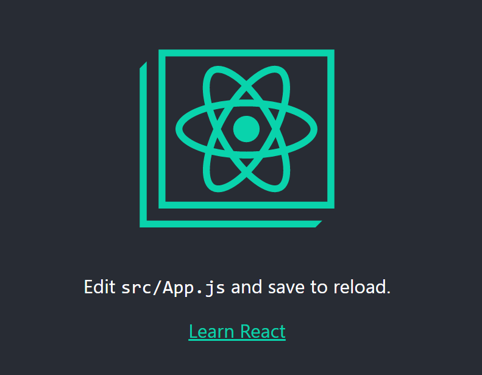
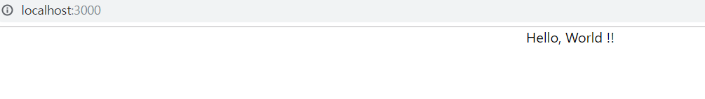
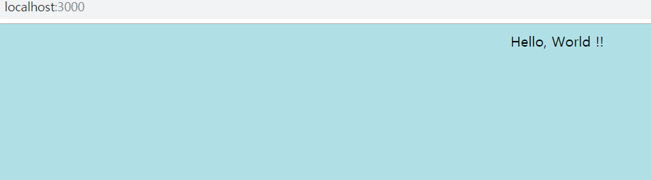

# React
> 해당 샘플코드는 ...에 있습니다.

## React?
facebook.com의 UI를 더 잘만들기 위해서 facebook에서 만든 javascript UI 라이브러리 [공식 홈페이지](https://reactjs.org)

> 운영체제: 윈도우10  
> IDE: VS Code
  
Component?  
- 복잡한 코드를 사용자 정의 태그를 이용하여 편리하게 사용할 수 있다.(=component) 즉, 한번 정의해놓으면 여러곳에서 재사용할 수 있다.

Component 장점
- 가독성
- 재사용성
- 유지보수
  
  
## 개발환경(CMD)
NPM: Nodejs로 만들어진 프로그램을 쉽게 설치하게 해주는 일종의 앱스토어
- https://nodejs.org/en/ 접속하여 설치한다.

- 설치여부 확인
  ```
    // npm 설치여부 확인(버전 정보가 나오면 설치가 완료된것이다.)
    npm -v
  ```

- React Project 설치(v2.1.8 기준)
  ```
    // 명령을 실행하여 react project global 설치(-g 옵션을 주면 어디서든 사용이 가능하다)
    npm install -g create-react-app@2.1.8

    // 명령을 실행하여 설치여부 확인
    create-react-app

    // 설치할 폴더를 생성
    mkdir react-app

    // react project를 설치할 폴더로 이동
    cd react-app

    // 이동한 경로에 react project를 설치
    create-react-app .
  ```

- React Project 실행
  - 먼저 VS Code 상위 메뉴에서 View -> Appearance -> Show Panel을 선택하고
터미널을 선택하면 명령어 내부적으로 설치되어있는 CMD가 실행된다.

  - React Project 실행
    ```
    npm run start   // 실행하면 3000 port의 주소가 표시되는데 그곳으로 접속하면 된다.
    ```

  - React Project 종료: Ctrl + C 를 눌러서 종료한다.


## 코드변경(JS)
먼저 초기 구축되는 구조는 아래와 같다.  
```
    react-app
    ├── .git    
    ├── node_modules
    ├── public
    │    └── index.html
    ├── src
    ├── .gitignore
    ├── package.json
    ├── README.md
    └── yarn.lock
```

- public: index.html이 있는곳이다. (ex: http://localhost:3000/index.html)

- index.html: 내용에 <div id="root"></div> 가 있는데 이 태그 안에는 component가 들어가도록 create-react-app은 약속되어있는 상태이다.(변경가능)

- index.js: 진입파일
  ```
    import React from 'react';
    import ReactDOM from 'react-dom';
    import './index.css';
    import App from './App';
    import * as serviceWorker from './serviceWorker';

    // <App />는 React를 통해만든 사용자 정의 태그(=Component)이다. 실제 구현은 상위의 import 되어있는 App(=App.js)이다.
    // document.getElementById('root')는 index.html 파일에서 <div id="root"> 로 지정되어있다.
    ReactDOM.render(<App />, document.getElementById('root'));

    // If you want your app to work offline and load faster, you can change
    // unregister() to register() below. Note this comes with some pitfalls.
    // Learn more about service workers: https://bit.ly/CRA-PWA
    serviceWorker.unregister();
  ```
  > 아래와 같은 방식으로 사용자 정의 태그를 변경할 수 있다.
  ```
    ...
    
    // .. './App'; 는 파일경로라 바꾸면 안된다.
    import AppNew from './App';

    ...

    ReactDOM.render(<AppNew />, document.getElementById('root'));

    ...
  ```

- 작업하기전 먼저 src/App.js의 코드를 function type -> class type 으로 변경한다. (설명은 나중에)
  ```
    /*
    import React from 'react';
    import logo from './logo.svg';
    import './App.css';

    function App() {
        return (
            <div className="App">
            <header className="App-header">
                
                <p>
                Edit <code>src/App.js</code> and save to reload.
                </p>
                <a
                className="App-link"
                href="https://reactjs.org"
                target="_blank"
                rel="noopener noreferrer"
                >
                Learn React
                </a>
            </header>
            </div>
        );
    }
    */

    import React, { Component } from 'react';
    import logo from './logo.svg';
    import './App.css';

    class App extends Component {
        render() {
            return (
                <div className="App">
                <header className="App-header">
                    
                    <p>
                    Edit <code>src/App.js</code> and save to reload.
                    </p>
                    <a
                    className="App-link"
                    href="https://reactjs.org"
                    target="_blank"
                    rel="noopener noreferrer"
                    >
                    Learn React
                    </a>
                </header>
                </div>
            );
        }
    }

    export default App;
  
  ```
  > 실제 사용자 정의 태그은 <App /> 에 반영되는 태그는 <div className="App" /> 태그가 반영된다.

    

- 위의 코드를 변경하고 http://localhost:3000에서 확인
  ```
    import React, { Component } from 'react';
    import logo from './logo.svg';
    import './App.css';

    class App extends Component {
        render() {
            return (
                <div className="App">
                    Hello, World !!
                </div>
            );
        }
    }

    export default App;
  ```
    


## 코드변경(CSS)
프로젝트 경로에 src/index.js 파일에 import './index.css'; 라는 것이 있다. 해당 경로로 들어가서 코드를 변경하자.
```
    body {
        background-color: powderblue;
    }
```
  

다음 작업 시 CSS에 영향받지 않게끔 하기의 css 파일의 내용을 모두 지워준다.
- src/index.css
- src/App.css
> 여기까지 완료되면 실습환경 구축과 코드작성 후 실행까지 완료했다.

## 빌드/배포(개발환경과 운영환경의 차이)
- 빌드
  - npm run start로 실행하면 개발의 편의성을 위하여 여러가지 기능이 추가되어있기 때문에 상당히 파일의 무게가 무겁다 그러나 이것을 운영환경에서 사용하면 여러가지 이슈가 생기기 때문에 빌드를 해야 한다.
    ```
        npm run build
    ```
    위의 명령을 실행하면 build라는 폴더가 생성된다. 그 안에서 index.html 을 실행해보면 공백이 하나도 없고 난독화 되어있다. 왜냐하면 실제 운영환경에서 사용할 앱을 만들기 위해서 불필요한 공백과 같은 것들을 다 없애준 것이다. 그러므로 용량이 훨씬 작아진다.

    > 실제로 서비스할때는 build안에 있는 파일들을 사용하면 된다. 즉, 웹 서버가 문서를 찾는 최상위 디렉토리는 build 디렉토리 안쪽에 있는 파일로 위치시키면 된다.

- 간단한 웹 서버 설치(serve)
  ```
    // -s 옵션은 build라는 폴더를 document root로 지정하겠다는 옵션이다.
    npx serve -s build
  ```
  > 표시된 주소로 실행하여 크롬 개발자도구에서 network의 파일용량을 확인해보면 현저히 줄어든 부분을 확인할 수 있다.


## 참고
inflearn.com/course/react-생활코딩#