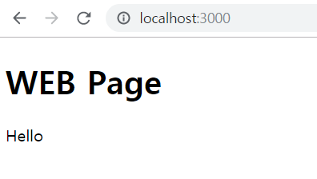

# 컴포넌트


## 리액트의 필요성
설명하기전에 앞서 아래 시멘틱 태그가 정의된 html 코드를 참고하자.
> 시멘틱 태그: HTML5의 스펙이며 header, footer 태그와 같은 부분을 의미론적으로 적용할때 사용

public/ 경로에 example.html 라는 파일을 생성하여 코드를 아래와 같이 작성하자.
```
    <html>
        <body>
            <header>
                <h1>WEB Page</h1>
                Hello
            </header>
            
            <nav>
                <ul>
                    <li><a href="1.html">HTML</a></li>
                    <li><a href="2.html">React</a></li>
                    <li><a href="3.html">Javascript</a></li>
                </ul>
            </nav>

            <article>
                <h2>WEB page 2</h2>
                Hello Example.
            </article>
        </body>
    </html>
``` 

만약 위의 태그별로 백만줄 또는 천만줄 이상이라고 생각해보자. 그러면 한 눈에 코드가 보이지 않기 마련이다.
그렇게 된다면 해당 줄이 긴 태그를 감추고 사용자 정의 태그로 나타낸다면 웹 페이지에서는 긴 태그가 모두 표시되겠지만 우리눈에는 사용자 정의 태그로 한 눈에 깔끔하게 보이게 될 것이다. (아래 코드를 참고)

```
    <html>
        <body>
            <!-- 사용자 정의 태그 -->
            <PageHeader></PageHeader>
            
            <nav>
                <ul>
                    <li><a href="1.html">HTML</a></li>
                    <li><a href="2.html">React</a></li>
                    <li><a href="3.html">Javascript</a></li>
                </ul>
            </nav>

            <article>
                <h2>WEB page 2</h2>
                Hello Example.
            </article>
        </body>
    </html>
```
위와 같이 사용자 정의 태그를 지정한 것 처럼 기능을 단위별로 캡슐화하는 리액트의 기본 단위는 **컴포넌트** 라고 한다. 즉, 사용자가 보는 뷰는 컴포넌트들을 조합하여 만든다.


## 컴포넌트 만들기 개념  
[public/example.html]
```
    <html>
        <body>
            <header>
                <h1>WEB Page</h1>
                Hello
            </header>
            
            <nav>
                <ul>
                    <li><a href="1.html">HTML</a></li>
                    <li><a href="2.html">React</a></li>
                    <li><a href="3.html">Javascript</a></li>
                </ul>
            </nav>

            <article>
                <h2>WEB page 2</h2>
                Hello Example.
            </article>
        </body>
    </html>
```

[src/App.js]
```
    import React, { Component } from 'react';
    import './App.css';

    class App extends Component {
        render() {
            return (
                <div className="App">
                    Hello, World !!
                </div>
            );
        }
    }

    export default App;
```

위의 App.js의 코드를 참고해보면 아래와 같은 부분이 Component를 만드는 코드이다. 
```
    class App extends Component {
        render() {
            return (
                <div className="App">
                    Hello, World !!
                </div>
            );
        }
    }
```

그럼 example.html <header> 태그를 컴포넌트와 시키는 작업을 시작하자. 먼저 App.js에서 위의 Component를 만드는 태그를 복사하여 위쪽에 class를 추가 작성하자.
```
    class PageHeader extends Component {
        render() {
            return (
                <header>
                    <h1>WEB Page</h1>
                    Hello
                </header>
            );
        }
    }
```
> Component는 header태그 또는 div className="App"태그와 같이 반드시! 하나의 최상위 태그로 시작하여야 한다.  

그 다음 PageHeader Component를 하단의 div className="App"태그 안에 삽입한다.
```
    class App extends Component {
        render() {
            return (
                <div className="App">
                    <PageHeader></PageHeader>
                </div>
            );
        }
    }
```

그리고 페이지를 확인해보면 PageHeader 컴포넌트가 삽입된 뷰를 확인할 수 있다.



## 컴포넌트 만들기 개념 마무리
위의 컴포넌트 만들기 개념 내용처럼 나머지 코드들도 컴포넌트화 시켜보자.  
[src/App.js]
```
    ...

    class PageNav extends Component {
        render() {
            return (
                <nav>
                    <ul>
                    <li><a href="1.html">HTML</a></li>
                    <li><a href="2.html">React</a></li>
                    <li><a href="3.html">Javascript</a></li>
                    </ul>
                </nav>
            );
        }
    }

    class PageArticle extends Component {
        render() {
            return (
                <article>
                    <h2>WEB page 2</h2>
                    Hello Example.
                </article>
            )
        }
    }

    class App extends Component {
        render() {
            return (
                <div className="App">
                    <PageHeader></PageHeader>
                    <PageNav></PageNav>
                    <PageArticle></PageArticle>
                </div>
            );
        }
    }
```

> 기존에 example.html 코드와 위의 Component화 시킨 코드를 비교해보면 매우 간결화 된 것을 확인할 수 있다.


## props
props는 부모 Component가 자식 Component에게 주는 값이다. 즉, 자식 Component에서는 props를 받아오기만 하고, 받아온 props를 직접 수정할 수 없다.

예를 들어 위에서 사용한 PageHeader 컴포넌트를 사용한 예시를 들어보자.  
우선 아래 코드를 보면
```
    <PageHeader></PageHeader>
    <PageHeader></PageHeader>
```
이렇게 될 경우 똑같은 내용을 두 번 표시하게 된다. 여기서 PageHeader title="제목1" subTitle="제목2" 이런식으로 지정하여 원하는 내용으로 변경되어 표시하고 싶게 하려면 props 기술을 사용하면 된다.

먼저 PageHeader title="제목1" subTitle="제목2" 태그에서 title, subTitle에 입력된 내용을 PageHeader Component가 알아내서 표시해줘야 한다. 그때 사용하기로 약속된 [JSX](https://reactjs.org/docs/components-and-props.html)의 기호를 사용하여 아래와 같이 PageHeader Component를 변경하자   
[App.js]
```
    class PageHeader extends Component {
        render() {
            return (
                <header>
                    <h1>{this.props.title}</h1>
                    {this.props.subTitle}
                </header>
            );
        }
    }

    class App extends Component {
        render() {
            return (
                <div className="App">
                    <PageHeader title="Title Example" subTitle="Sub Title Example"></PageHeader>
                    <PageNav></PageNav>
                    <PageArticle></PageArticle>
                </div>
            );
        }
    }
```
위와 같이 변경하면 결과는 아래와 같다.


> PageHeader title="Title Example" subTitle="Sub Title Example" 에서 title, subTitle을 변경하면 변경된 값으로 페이지에 표시되는 내용이 변경되는 부분을 확인할 수 있다.  

다른 컴포넌트에도 적용해보자.  
[App.js]
```
    class PageArticle extends Component {
        render() {
            return (
                <article>
                    <h2>{this.props.title}</h2>
                    {this.props.contents}
                </article>
            )
        }
    }

    class App extends Component {
        render() {
            return (
                <div className="App">
                    <PageHeader title="Title Example" subTitle="Sub Title Example"></PageHeader>
                    <PageNav></PageNav>
                    <PageArticle title="Title Article" contents="Contents Article"></PageArticle>
                </div>
            );
        }
    }
```
위와 같이 변경하면 결과는 아래와 같다.


## 리액트 개발툴
https://reactjs.org/community/support.html를 보면 리액트를 개발할 때 필요한 Tool들이 있다.
  
Debugging: React App을 개발할 때 상태를 확인할 수 있다.  
[React Developer Tools](https://chrome.google.com/webstore/detail/react-developer-tools/fmkadmapgofadopljbjfkapdkoienihi) (크롬기준이며 설치 후 크롬을 재시작하자.)
    > 만약 "Allow access to file URLs" 문제가 발생하여 활성화가 안된다면 크롬 우측메뉴에서 "도구 더보기 -> 확장 프로그램 -> 원하는 앱의 세부정보 클릭 -> 파일 URL에 대한 엑세스 허용 활성화"를 하면 된다.


위와 같이 개발자 도구(F12)에서 React 관련 탭이 생성되어 해당 탭을 클릭하여 props와 같은 내용을 변경하여 바로 확인할 수 있다.


## Component 분리
App.js에는 이전에 작업하였던 여러가지의 Component가 선언되어있다. 그런데 만약 이러한 Component들이 엄청나게 많이 존재한다면 관리하기 힘들어진다. 그러므로 각각의 Component별 별도의 파일로 분리시키자.
  
먼저 src/components라는 폴더를 생성하자. 그리고 그 안에 PageNav.js를 생성하고 App.js에 있는 PageNav Component를 PageNav.js내용에 붙여넣자.
  
[components/PageNav.js]
```
    import React, { Component } from 'react';

    class PageNav extends Component {
        render() {
            return (
                <nav>
                    <ul>
                    <li><a href="1.html">HTML</a></li>
                    <li><a href="2.html">React</a></li>
                    <li><a href="3.html">Javascript</a></li>
                    </ul>
                </nav>
            );
        }
    }

    export default PageNav;
```
위의 export default PageNav는 PageNav.js를 가져다 쓰는 쪽에서 PageNav라는 class를 가져다 사용할 수 있게 한다.

그럼 이제 위의 class를 갖다 쓰려면 아래 코드와 같이 App.js에서 import를 해주면 분리가 완료된 것이다.  
[App.js]
```
    import React, { Component } from 'react';
    import PageNav from './components/PageNav';
    ...
```

다른 Component들도 적용시켜보자.  
[components/PageHeader]
```
    import React, { Component } from 'react';

    class PageHeader extends Component {
        render() {
            return (
                <header>
                    <h1>{this.props.title}</h1>
                    {this.props.subTitle}
                </header>
            );
        }
    }

    export default PageHeader;
```
  
[components/PageArticle]
```
    import React, { Component } from 'react';

    class PageArticle extends Component {
        render() {
            return (
                <article>
                    <h2>{this.props.title}</h2>
                    {this.props.contents}
                </article>
            )
        }
    }

    export default PageArticle;
```
  
[App.js]
```
    import React, { Component } from 'react';
    import PageNav from './components/PageNav';
    import PageHeader from './components/PageHeader';
    import PageArticle from './components/PageArticle';
    ...
```

[결과]
  
> 즉, 이렇게되면 코드가 간결화되고 필요한 컴포넌트를 찾아 사용하기가 수월하다. 그리고 App.js가 아니라 다른곳에서도 해당 Component를 갖다 사용할 수 있다.

## 완성코드
[react-app-example-2](https://github.com/bkjeon1614/javascript-study/tree/master/reactjs/study/base/react-app-example-2)

## 참고
inflearn.com/course/react-생활코딩#
