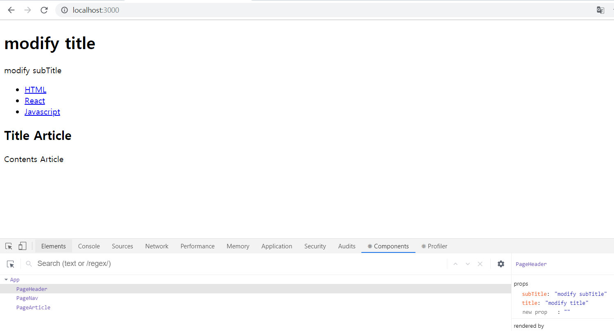
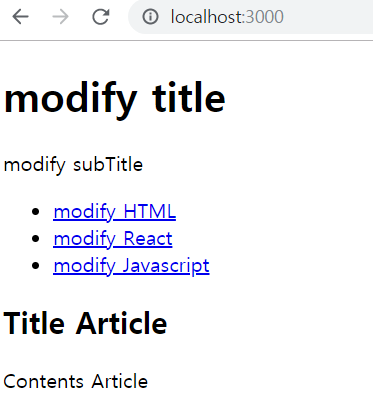
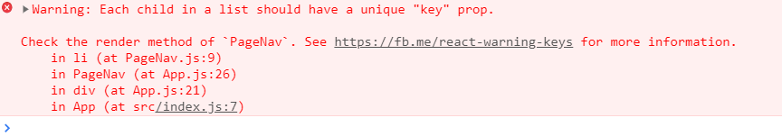

# Component 두번째

## state
props는 사용자가 Component를 사용하는 입장에서 중요하며 state는 props의 값에 따라서 내부의 구현에 필요한 데이터들이 state이다.
즉, 사용하는 쪽(=props)과 구현하는 쪽(=state)을 격리시켜서 양쪽의 편의성을 각자 도모하는것이다.
```
    Props => Component(State)
```

## state 사용
[App.js]
```
    import React, { Component } from 'react';
    import PageNav from './components/PageNav';
    import PageHeader from './components/PageHeader';
    import PageArticle from './components/PageArticle';
    import './App.css';

    class App extends Component {
        render() {
            return (
                <div className="App">
                    <PageHeader title="Title Example" subTitle="Sub Title Example"></PageHeader>
                    <PageNav></PageNav>
                    <PageArticle title="Title Article" contents="Contents Article"></PageArticle>
                </div>
            );
        }
    }

    export default App;
```
위의 코드에서 하위컴포넌트들(PageHeader, PageArticle)의 props의 값들(title, subTitle ...))이 하드코딩 되어있으니 보기가 불편하다. 그래서 해당 값들을 state로 만들고 그 다음 state값을 PageHeader Component의 props로 전달하는걸 통해서 코드를 개선하자.

아래는 코드를 참고하면 Component가 실행될때 render라는 함수보다 먼저 실행되어 그 Component를 초기화 시켜주고 싶은 코드는 constructor(=생성자) 안에다가 코드를 만들면 된다.
```
    import React, { Component } from 'react';
    import PageNav from './components/PageNav';
    import PageHeader from './components/PageHeader';
    import PageArticle from './components/PageArticle';
    import './App.css';

    class App extends Component {
        constructor(props) {
            super(props)
            this.state = {
                header: {title:'modify title', subTitle: 'modify subTitle'}
            }
        }
        render() {
            return (
                <div className="App">
                    <PageHeader 
                    title={this.state.header.title} 
                    subTitle={this.state.header.subTitle}
                    ></PageHeader>
                    <PageNav></PageNav>
                    <PageArticle title="Title Article" contents="Contents Article"></PageArticle>
                </div>
            );
        }
    }

    export default App;
```
아래 이미지와 같이 state값이 반영된 것을 확인할 수 있다.


> index.js에 ReactDOM.render(...) 에서 App이라는 Component를 실행하는 코드가 있는데 이 코드가 내부적으로 state값이 header가 있는지 알 수 없다. 즉, 외부에서 알 필요가 없는 정보를 철저하게 은닉하는것이 핵심이다. -> App의 내부적으로 사용하기 위해서는 state를 사용

결론적으론 위의 코드는 state로 데이터를 은닉시키고 그렇게 만든 state값을 PageHeader라는 Component에 props값으로 전달했다. 상위 Component의 App의 상태를 하위 Component에 전달하기 위해서는 상위 Component의 state값을 하위 Component의 props값을 전달하는것은 얼마든지 가능하다.


## state props와 render의 활용한 event개념 맛보기
state를 여러개의 값을 사용했을때의 사용법을 알아보자.
  
[App.js]
```
    import React, { Component } from 'react';
    import PageNav from './components/PageNav';
    import PageHeader from './components/PageHeader';
    import PageArticle from './components/PageArticle';
    import './App.css';

    class App extends Component {
        constructor(props) {
            super(props)
            this.state = {
                header: {title:'modify title', subTitle: 'modify subTitle'}
            }
        }
        render() {
            return (
                <div className="App">
                    <PageHeader 
                    title={this.state.header.title} 
                    subTitle={this.state.header.subTitle}
                    ></PageHeader>
                    <PageNav></PageNav>
                    <PageArticle title="Title Article" contents="Contents Article"></PageArticle>
                </div>
            );
        }
    }

    export default App;
```
위의 코드에서 PageNav 안에있는 데이터를 App의 내부 state를 PageNav에 주입해주는 것을 통해서 자동으로 데이터가 변경되게 할 것이다.

먼저 App.js에 아래와 같이 state에 contents를 추가하고 PageNav에 data={this.state.contents}를 작성하자.  
[App.js]
```
    import React, { Component } from 'react';
    import PageNav from './components/PageNav';
    import PageHeader from './components/PageHeader';
    import PageArticle from './components/PageArticle';
    import './App.css';

    class App extends Component {
        constructor(props) {
            super(props)
            this.state = {
                header: {title:'modify title', subTitle: 'modify subTitle'},
                contents:[
                    {id:1, title:"modify HTML", subTitle:'modify HTML subTitle'},
                    {id:2, title:"modify React", subTitle:'modify React subTitle'},
                    {id:3, title:"modify Javascript", subTitle:'modify HTML Javascript'}
                ]
            }
        }
        render() {
            return (
                <div className="App">
                    <PageHeader 
                    title={this.state.header.title} 
                    subTitle={this.state.header.subTitle}
                    ></PageHeader>
                    <PageNav data={this.state.contents}></PageNav>
                    <PageArticle title="Title Article" contents="Contents Article"></PageArticle>
                </div>
            );
        }
    }

    export default App;
```

그 다음 PageNav.js에 list를 표시해주는 코드를 작성하자.  
[PageNav.js]
```
    import React, { Component } from 'react';

    class PageNav extends Component {
        render() {
            var list = [];
            var data = this.props.data
            var i = 0;
            while(i < data.length) {
                list.push(<li><a href={"/content/"+data[i].id}>{data[i].title}</a></li>)
                i = i + 1;
            }
            return (
                <nav>
                    <ul>
                        {list}
                    </ul>
                </nav>
            );
        }
    }

    export default PageNav;
```

이렇게 작성하면 App.js의 state.contents가 변경됨에 따라 페이지에 변경된 내용이 표시된다.
  

여기서 주의할점은 PageNav.js에서 list.push쪽을 보면 자동으로 여러개의 element를 생성하는 경우에 페이지에서 개발자 도구의 console을 보면 아래 이미지와 같이 에러가 발생한다.

이럴경우 아래와 같이 key를 지정해준다.(식별자지정)
```
    list.push(<li key={data[i].id}><a href={"/content/"+data[i].id}>{data[i].title}</a></li>)
```
이렇게 하면 에러가 사라진다.

> 결론적으론 App의 입장에서는 state라는 내부정보를 사용했고 그것을 자식한테 전달할때는 props라는 것을 통해서 전달하고 있다. 그러므로 App의 입장에서는 PageNav가 어떻게 동작하는지 알 필요가 없다. data라고 하는 props로는 어떤 형태의 정보를 전달하면 되는지만 즉, 사용자의 입장에서 알아야되는 부분만 알면 된다.

그리고 아래처럼 App.js의 코드를 수정해보고 페이지를 확인하자.
```
    ...
        class App extends Component {
            constructor(props) {
                super(props)
                this.state = {
                    mode: 'welcome',
                    header: {title:'modify title', subTitle: 'modify subTitle'},
                    contents:[
                        {id:1, title:"modify HTML", subTitle:'modify HTML subTitle'},
                        {id:2, title:"modify React", subTitle:'modify React subTitle'},
                        {id:3, title:"modify Javascript", subTitle:'modify HTML Javascript'}
                    ]
                }
            }
            render() {
                // mode가 welcome일 경우와 read일 경우에 표시되는 내용을 확인하자.
                var _title, _subTitle = null;
                if (this.state.mode === 'welcome') {
                    _title = this.state.header.title;
                    _subTitle = this.state.header.subTitle;
                } else if (this.state.mode === 'read') {
                    _title = this.state.contents[0].title;
                    _subTitle = this.state.contents[0].subTitle;
                }
                return (
                    <div className="App">
                        <PageHeader 
                        title={this.state.header.title} 
                        subTitle={this.state.header.subTitle}
                        ></PageHeader>
                        <PageNav data={this.state.contents}></PageNav>
                        <PageArticle title="Title Article" contents="Contents Article"></PageArticle>
                    </div>
                );
            }
        }
    ...
```


## 완성코드
[react-app-example-3](https://github.com/bkjeon1614/javascript-study/tree/master/reactjs/study/base/react-app-example-3)

## 참고
inflearn.com/course/react-생활코딩#
