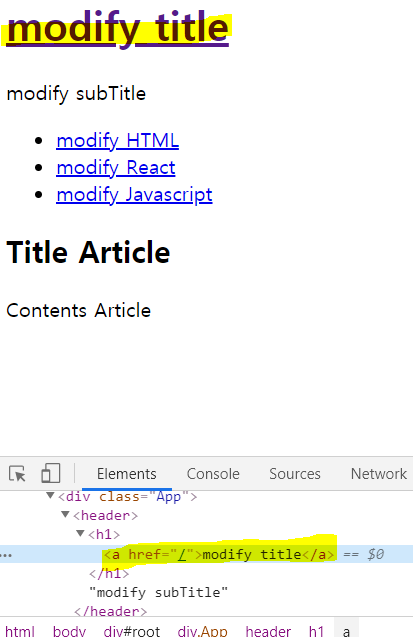
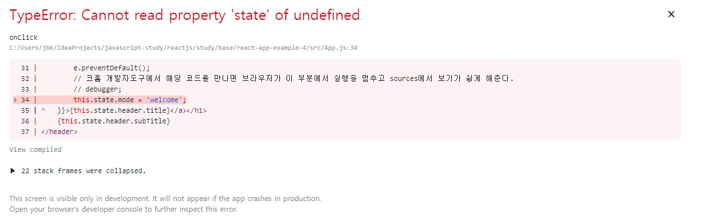
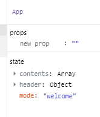
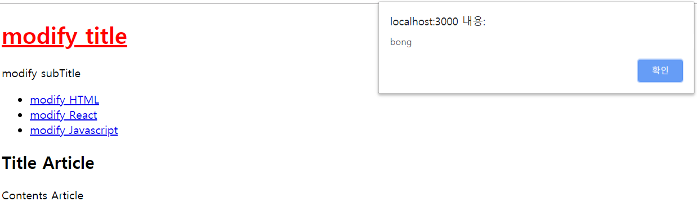

# Event

## 이벤트 설치
아래 이미지에서 색칠된 제목인 modify title을 클릭했을 떄 PageHeader태그 바깥쪽에있는 App의 state를 바꾸는 작업을 시작하자.  


우선 이해를 돕기 위하여 PageHeader의 Component를 풀어서 그걸 그대로 App에 도입하여 이벤트를 구현하자.

1. PageHeader에서 아래 코드를 복사
   ```
       ...
       <header>
           <h1>{this.props.title}</h1>
           {this.props.subTitle}
       </header>
       ...
   ```

2. App.js에 1번의 복사한 코드를 아래와 같이 붙여넣고 PageHeader를 주석처리 한다. 그리고 props를 사용하는 부분을 state로 변경한다.
   ```
        ...
        render() {
            return (
                <div className="App">
                    {/*<PageHeader 
                    title={this.state.header.title} 
                    subTitle={this.state.header.subTitle}
                    ></PageHeader>*/}
                    <header>
                        <h1><a href="/">{this.state.header.title}</a></h1>
                        {this.state.header.subTitle}
                    </header>
                    <PageNav data={this.state.contents}></PageNav>
                    <PageArticle title="Title Article" contents="Contents Article"></PageArticle>
                </div>
            );
        }
        ...
   ```

3. 2번의 코드내용에서 header태그 내부의 title을 클릭 시 click event 기능을 넣어준다.
   ```
        <header>
            <h1><a href="/" onClick={function(e) {
                // onClick event가 실행될 때 react는 해당 함수의 첫번째 매개변수의 값으로 event라는 객체를 주입해주기로 약속되어있다.
                console.log(e);
                // 해당 event가 발생한 태그의 기본동작을 못하게 막는 것(a 태그의 기본적인 동작방법인 href를 금지시킴)
                e.preventDefault();
                // 크롬 개발자도구에서 해당 코드를 만나면 브라우저가 이 부분에서 실행을 멈추고 sources에서 보기가 쉽게 해준다.
                // debugger;
            }}>{this.state.header.title}</a></h1>
            {this.state.header.subTitle}
        </header>
   ```   


## 이벤트에서 state 변경
App.js에서 이전에 state를 setting해놓은 작업과 그리고 event를 설치한 작업을 연결시켜야만 완성이된다.

App.js 코드상의 a태그를 페이지에서(=modify title) 클릭했을 때 App Component의 mode값을 welcome이라고 바꾸려면 어떻게 해야할지 아래 코드를 참고하자.
```
  render() {
    return (
        ...
        <header>
            <h1><a href="/" onClick={function(e) {
                ... 
                // 아래 코드를 추가해보자.
                this.state.mode = 'welcome';
            }}>{this.state.header.title}</a></h1>
            {this.state.header.subTitle}
        </header>
        ...
    );
  }
```
위의 코드인 this.state.mode = 'welcome'; 를 추가하면 아래 이미지와 같은 에러를 표시하게된다.


왜냐하면 위의 코드에서 해당 이벤트가 호출되었을때 함수 안에서는 this의 값이 Component 자기 자신을 가리키지않고 아무것도 세팅되어있지가 않으므로 undefined의 state를 읽으려했더니 할 수 없다고 에러를 표시하는것이다. 해결방법은 아래 코드를 참고하자.
```
    // 끝에 bind(this)를 추가하면 해당 this는 우리의 Component가 되는것이다.
    onClick={function(e) {
        ...
        this.state.mode = 'welcome';
    }}.bind(this)
```

위의 코드처럼 수정한 후 페이지에서 modify title을 다시 클릭해보자. 하지만 클릭해도 아무것도 안바뀐모습을 확인할 수 있다. 왜냐하면 위의 코드처럼 짜면 react는 state값이 바뀌었는지를 인지하지 못한다. 그러므로 아래와 같이 코드를 변경하자.
```
    onClick={function(e) {
        ...
        // this.state.mode = 'welcome';
        // 아래와 같이 작성하자.
        this.setState({
            mode: 'welcome'
        })
    }}.bind(this)
```
그럼 개발자도구에서 mode값이 welcome으로 변경된걸 확인할 수 있다.


> 중요 포인트는 아래와 같다.
> 1. bind  
> 2. setState  


## bind 함수란
App.js 코드를 보면 render()라는 함수 안에서 this는 render() 함수가 속해있는 Component 자체를 가리킨다. 그리고 header태그 안의 a태그에 onClick 함수는 this가 아무값도 없다. (아직 원리를 이해하려고 하기보다는 이렇구나 정도로만 이해하면 된다.)
`이럴경우 강제로 this를 주입하는 방법만 알면된다. 그것이 bind함수이다.`


## Event setState
먼저 App.js를 보면 여기서 App라고하는 Component가 생성될 때 최초로 가장 먼저 실행되는 constructor 함수에서는 아래와 같이 수정하면된다.
```
    ...
        constructor(props) {
            super(props)
            this.state = {
                header: {title:'modify title', subTitle: 'modify subTitle'},
                contents:[
                    {id:1, title:"modify HTML", subTitle:'modify HTML subTitle'},
                    {id:2, title:"modify React", subTitle:'modify React subTitle'},
                    {id:3, title:"modify Javascript", subTitle:'modify HTML Javascript'}
                ]
            }
        }
    ...
```

하지만 이미 Component가 생성이 끝난 다음에 동적으로 state값을 바꿀때는 this.state.mode = 'welcome'; 과 같은 식으로 바꾸면 안되고 아래와 같이 변경하자.
```
    ...
        this.setState({
            mode:'welcome'
        })
    ...
```

> 이유는 react 입장에서는 this.state.mode = 'welcome'; 이런식으로 변경하게 된다면 react가 인지못하게 몰래 바꾼식으로 되서 렌더링을 할 수 없게된다. 그러므로 setState로 항상 변경해준다.


## Component Event - 1
우리의 태그에 이벤트를 우리가 만들어서 그 태그를 또는 컴포넌트를 사용하는 사람들이 이벤트 프로그래밍을 할 수 있도록 해보자. 즉, 이벤트를 만들어보는 생산자가 될 것이다.

먼저 App.js 코드에서 PageHeader Component 부분을 살리고 header 부분을 비활성화 시켜보자. (PageHeader를 주석했던 이유는 이전 내용에서 이해를 원활하게 돕기 위함이였다.)
```
    ...
      <div className="App">
        <PageHeader 
          title={this.state.header.title} 
          subTitle={this.state.header.subTitle}
        ></PageHeader>
        {/*<header>
            <h1><a href="/" onClick={function(e) {
                console.log(e);
                e.preventDefault();
                this.setState({
                  mode: 'welcome'
                })
            }.bind(this)}>{this.state.header.title}</a></h1>
            {this.state.header.subTitle}
        </header>*/}
        <PageNav data={this.state.contents}></PageNav>
        <PageArticle title="Title Article" contents="Contents Article"></PageArticle>
      </div>    
    ...
```

PageHeader.js 코드또한 아래와 같이 수정한다.
```
    import React, { Component } from 'react';

    class PageHeader extends Component {
        render() {
            console.log('PageHeader render')
            return (
                <header>
                    <h1><a href="/">{this.props.title}</a></h1>
                    {this.props.subTitle}
                </header>
            );
        }
    }

    export default PageHeader;
```

만약 사용자가 페이지상의 modify title 즉 PageHeader Component의 a태그를 클릭할 때 이벤트가 일어나게 하려면 App.js의 PageHeader 태그의 onChangePage를 사용하자.
[App.js]
```
    <PageHeader 
        title={this.state.header.title} 
        subTitle={this.state.header.subTitle}
        onChangePage={function(){
          alert('bong');
        }.bind(this)}
    ></PageHeader>
```
`위의 코드는 PageHeader Component 안에서 링크를 클릭했을 때 이 이벤트에 설치한 함수를 호출하도록 만들려고 하는것이다.`

그 다음 우리가 만든 PageHeader Component는 Page가 바뀌었을 때(즉, 누군가가 PageHeader 내부에 명시되어있는 a태그를 클릭했을 때) 이 Component의 사용자가 설치한 해당 함수를 호출해주기만 하면된다. 그럴땐 props를 사용하자.
[PageHeader.js]
```
    ...
        class PageHeader extends Component {
            render() {
                console.log('PageHeader render')
                return (
                    <header>
                        <h1><a href="/" onClick={function(e){
                            e.preventDefault();
                            // App.js의 PageHeader Component에 명시된 onChangePage 함수이다.
                            this.props.onChangePage();
                        }.bind(this)}>{this.props.title}</a></h1>
                        {this.props.subTitle}
                    </header>
                );
            }
        }
    ...
```

이렇게 적용하고 페이지에서 modify title을 클릭하면 결과는 아래 이미지와 같다.


> 다시 설명하자면 우리는 PageHeader라는 Component에 onChangePage라는 event를 우리가 만들었다. 그리고 그 이벤트에 함수를 설치해주면 해당 이벤트가 발생되었을 때(즉, PageHeader.js의 a태그를 클릭했을 때) 우리는 props로 전달된 onChangePage라는 함수를 호출하면 되는것이다. 그렇게해서 경고창이 표시되었던 것이다.


## Component Event - 2
이번에는 글 목록을 클릭했을 때 해당되는 내용이 본문에 나오게 표시해보자. 우선 App.js의 PageNav Component에 event를 만들어보자.
[App.js]
```
    ...
        <div className="App">
            <PageHeader 
                title={this.state.header.title} 
                subTitle={this.state.header.subTitle}
                onChangePage={function(){
                    // alert('bong');
                    this.setState({mode: 'welcome'});
                }.bind(this)}
            ></PageHeader>
            <PageNav data={this.state.contents}></PageNav>
            <PageArticle title="Title Article" contents="Contents Article"></PageArticle>
        </div>
    ...
```

그 다음 PageNav를 수정하자.
[PageNav.js]
```
    ...
        class PageNav extends Component {
            render() {
                var list = [];
                var data = this.props.data
                var i = 0;
                while(i < data.length) {
                    list.push(
                    <li key={data[i].id}>
                        <a 
                        href={"/content/"+data[i].id}
                        onClick={function(e){
                            e.preventDefault();
                            this.props.onChangePage();
                        }.bind(this)}
                        >{data[i].title}</a>
                    </li>)
                    i = i + 1;
                }
                return (
                    <nav>
                        <ul>
                            {list}
                        </ul>
                    </nav>
                );
            }
        }
    ...
```

이제 App.js에서 
[App.js]
```
   ...
    <PageNav 
        onChangePage={function(){
          this.setState({mode:'read'});
        }.bind(this)}
        data={this.state.contents}
    ></PageNav>
   ... 
```

> 이렇게 수정이 완료되고 결과를 확인하면 페이지에서 modify title을 클릭했을 때 mode값은 welcome으로 변경되고 그 아래 목록(modify HTML, modify React ...)을 클릭했을때 mode값은 read로 변경되는것을 확인할 수 있다.

그 다음 App.js의 코드를 아래와 같이 수정해보자. 이제 목록을 클릭했을 때 내용이 변경되는 코드를 구현할것이다.
[App.js]
```
  ...
    class App extends Component {
        constructor(props) {
            super(props)
            this.state = {
                mode:'read',
                selected_content_id:2,
                header: {title:'modify title', subTitle: 'modify subTitle'},
                contents:[
                    {id:1, title:"modify HTML", subTitle:'modify HTML subTitle'},
                    {id:2, title:"modify React", subTitle:'modify React subTitle'},
                    {id:3, title:"modify Javascript", subTitle:'modify HTML Javascript'}
                ]
            }
        }
        render() {
            var _title, _subTitle = null;
            if (this.state.mode === 'welcome') {
                _title = this.state.welcome.title;
                _subTitle = this.state.welcome.subTitle;
            } else if (this.state.mode === 'read') {
                var i = 0;
                while(i < this.state.contents.length) {
                    var data = this.state.contents[i];
                    if (data.id === this.state.selected_content_id) {
                        _title = data.title;
                        _subTitle = data.subTitle;
                        break;
                    }
                    i = i + 1;
                }
            }
            return (
            <div className="App">
                <PageHeader 
                title={this.state.header.title} 
                subTitle={this.state.header.subTitle}
                onChangePage={function(){
                    this.setState({mode: 'welcome'});
                }.bind(this)}
                ></PageHeader>
                <PageNav 
                onChangePage={function(id){
                    this.setState({
                        mode:'read',
                        selected_content_id:Number(id)
                    });
                }.bind(this)}
                data={this.state.contents}
                ></PageNav>
                <PageArticle title={_title} contents={_subTitle}></PageArticle>
            </div>
            );
        }
    }
  ...
```

[PageNav.js]
```
    ...
        class PageNav extends Component {
            render() {
                var list = [];
                var data = this.props.data
                var i = 0;
                while(i < data.length) {
                    list.push(
                    <li key={data[i].id}>
                        <a 
                            href={"/content/"+data[i].id}
                            data-id={data[i].id}    // 해당 속성을 지정하고 아래 onClick event발생시 e라고 하는 event객체의 target 속성이 있고 target 속성은 해당 이벤트가 발생한 태그를 가리킨다. 그것을 함수에서 사용하면 a태그의 data-id값을 접근할 수 있다.
                            onClick={function(e){
                                e.preventDefault();
                                // data 마이너스라는 접두사로 시작되는 형식은 event객체의 target속성의 dataset으로 접근할 수 있다.
                                // 즉, data-bong 이면 event객체에서 e.target.dataset.bong과 같은식으로 접근이 가능하다.
                                this.props.onChangePage(e.target.dataset.id);
                            }.bind(this)}
                        >{data[i].title}</a>
                    </li>)
                    i = i + 1;
                }
                return (
                    <nav>
                        <ul>
                            {list}
                        </ul>
                    </nav>
                );
            }
        }
    ...
```

> 이렇게 작성하고 페이지에서 목록을 클릭하면 내용이 바뀌는것을 확인할 수 있다.

bind 함수의 특성을 이해하자
```
    data-id={data[i].id}    
    onClick={function(e){
        e.preventDefault();
        this.props.onChangePage(e.target.dataset.id);
    }.bind(this)}
```
``` 
    onClick={function(id, e){
        e.preventDefault();
        this.props.onChangePage(id);
    }.bind(this, data[i].id)}
```
`data-id를 사용안하고 bind의 두번째 인자로 해당 값을 넣어주면 해당 함수의 두번쨰 인자로 들어온 이 값을 첫번째 매개변수의 값으로 넣어주고 기존에 있었던 값은 뒤로 한칸 씩 밀려난다. 둘 중 편한것으로 사용하면 된다.`
