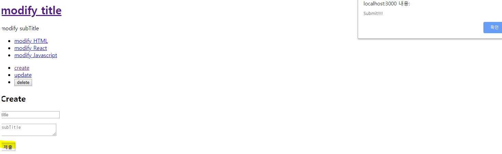

# Create

## 버튼 클릭시 저장 mode 변경 기능
이번 내용에서는 생성에 대한 부분을 만들것이다. 즉, Create 버튼을 클릭하면 Content의 목록에 새로운 값이 추가될것이다.

App.js 코드를 아래와 같이 버튼을 추가하자.  
[App.js]
```
    ...
        return (
            <div className="App">
                ...
                {/*추가*/}
                <ul>
                    <li><a href="/create">create</a></li>
                    <li><a href="/update">update</a></li>
                    <li><input type="button" value="delete"></input></li>
                </ul>
                <PageArticle title={_title} contents={_subTitle}></PageArticle>
            </div>
        );
    ...
```

위의 추가된 ul태그 안에 버튼들을 Component로 분리시켜보자.
먼저 src/components/Control.js 파일을 만들고 아래 내용을 추가하자.  
[Control.js]
```
import React, { Component } from 'react';

class Control extends Component {
    render() {
        {/* 아래 ul태그는 App.js에서 선언된 내용을 잘라내어 가져왔다. */}
        return (
            <ul>
                <li><a href="/create">create</a></li>
                <li><a href="/update">update</a></li>
                <li><input type="button" value="delete"></input></li>
            </ul>
        );
    }
}

export default Control;
```

App.js 파일에서 상단에 import Control from './components/Control'; 을 추가하고 아래 Control Component를 삽입한다.  
[App.js]
```
    ...
    return (
      <div className="App">
        ...
        <Control></Control>
        <PageArticle title={_title} contents={_subTitle}></PageArticle>
      </div>
    );
    ...
```

이제 위의 Component의 button을 클릭하면 각자 유형에 맞는 이벤트가 실행되기 위해서는 이벤트를 Control Component에 정의하자.   
[App.js]
```
    ...
    return (
      <div className="App">
        ...
        <Control onChangeMode={function(_mode){
          this.setState({
            mode:_mode
          })
        }.bind(this)}></Control>
        <PageArticle title={_title} contents={_subTitle}></PageArticle>
      </div>
    );
    ...
```

[Control.js]
```
    ...
    class Control extends Component {
        render() {
            return (
                <ul>
                    <li><a href="/create" onClick={function(e){
                        e.preventDefault();
                        this.props.onChangeMode('create');
                    }.bind(this)}>create</a></li>
                    <li><a href="/update" onClick={function(e){
                        e.preventDefault();
                        this.props.onChangeMode('update');
                    }.bind(this)}>update</a></li>
                    <li><input onClick={function(e){
                        e.preventDefault();
                        this.props.onChangeMode('delete');
                    }.bind(this)} type="button" value="delete"></input></li>
                </ul>
            );
        }
    }
    ...
```

이렇게 하고 페이지에서 create, update, delete를 각각 클릭해보면 mode값이 변환되는것을 확인할 수 있다.


## 버튼 클릭시 저장 mode 전환 기능
버튼을 클릭 시 App.js의 PageArticle Component가 Create 관련 Component로 바뀌게 할 것이다.

먼저 PageArticle의 명칭을 ReadContent로 변경하고 내부 코드를 아래와 같이 수정하자.  
[ReadContent]
```
import React, { Component } from 'react';

class ReadContent extends Component {
    render() {
        return (
            <article>
                <h2>{this.props.title}</h2>
                {this.props.contents}
            </article>
        )
    }
}

export default ReadContent;
```

App.js 에서도 import 부분과 Component 부분을 수정하자.  
[App.js]
```
  ...
  import ReadContent from './components/ReadContent';
  import Control from './components/Control';
  ...
      return (
      <div className="App">
        ...
        <ReadContent title={_title} contents={_subTitle}></ReadContent>
      </div>
    );
  ...
```

그 다음 src/components/CreateContent.js를 생성하고 아래 내용을 추가하자.  
[CreateContent.js]
```
import React, { Component } from 'react';

class CreateContent extends Component {
    render() {
        return (
            <article>
                <h2>Create</h2>
                <form>
                    
                </form>
            </article>
        )
    }
}

export default CreateContent;
```

이제 Create 버튼을 클릭 시 ReadContent가 있는 부분을 CreateContent로 교체하는 작업을 시작하자. 먼저 App.js 코드를 참고하면  
[App.js]
```
    return (
      <div className="App">
        ...
        <ReadContent title={_title} contents={_subTitle}></ReadContent>
      </div>
    );
```

위의 ReadContent 코드를 {_article} 이라는 변수로 수정하고 상단에 _article을 초기화해주고 조건에 따라 ReadContent 태그를 넣어주는 코드를 작성하자. 그리고 조건문에서 mode가 create일 때의 조건을 추가하자.  
[App.js]
```
    ...
    render() {
      var _title, _subTitle, _article = null;
      if (this.state.mode === 'welcome') {
        _title = this.state.header.title;
        _subTitle = this.state.header.subTitle;
        _article = <ReadContent title={_title} contents={_subTitle}></ReadContent>
      } else if (this.state.mode === 'read') {
        var i = 0;
        while(i < this.state.contents.length) {
          var data = this.state.contents[i];
          if (data.id === this.state.selected_content_id) {
            _title = data.title;
            _subTitle = data.subTitle;
            break;
          }
          i = i + 1;
        }
        _article = <ReadContent title={_title} contents={_subTitle}></ReadContent>
      } else if (this.state.mode === 'create') {
        _article = <CreateContent title={_title} contents={_subTitle}></CreateContent>
      }
      return (
        <div className="App">
          ...
          {_article}
        </div>
      );
    }
    ...
```

이렇게 수정하고 페이지에서 Create를 클릭하면 제일 하단의 Create 텍스트가 표시되는것을 볼 수 있다.


## CreateContent Component의 Form구현
이전에 생성하였던 CreateContent Component의 form태그 관련 내용을 작성하자.  
[CreateContent.js]
```
import React, { Component } from 'react';

class CreateContent extends Component {
    render() {
        return (
            <article>
              <h2>Create</h2>
              <form action="/create_process" method="post"
                onSubmit={function(e){
                  e.preventDefault();
                  alert('Submit!!!!');
                }.bind(this)}
              >
                <p><input type="text" name="title" placeholder="title"></input></p>
                <p>
                    <textarea name="subTitle" placeholder="subTitle"></textarea>
                </p>
                <p>
                    <input type="submit"></input>
                </p>
              </form>
            </article>
        )
    }
}

export default CreateContent;
```

그리고 debug하기가 쉽게끔 App.js의 default mode값을 create로 변경해준다.
```
  class App extends Component {
    constructor(props) {
      super(props)
      this.state = {
        mode:'create',
        ...
      }
    }
    ...
```

이렇게 작성하고 페이지에서 submit 버튼을 클릭하면 alert창이 표시되는걸 확인할 수 있다.



## Submit 버튼을 클릭했을 때 onSubmit event가 실행되면 CreateContent를 App Component의 contents에 data를 추가하는 기능을 만들자.

먼저 Submit 버튼을 클릭했을 때 CreateContent에 event로 설치된 함수를 실행시키는 코드를 작성해보자.  
[App.js]
```
  ...
    } else if (this.state.mode === 'create') {
      _article = <CreateContent onSubmit={function(_title, _subTitle) {
        console.log(_title, _subTitle)
      }.bind(this)}></CreateContent>
    }
  ...
```

[CreateContent.js]
```
  ...
  class CreateContent extends Component {
    render() {
        return (
            <article>
              <h2>Create</h2>
              <form action="/create_process" method="post"
                onSubmit={function(e){
                  e.preventDefault();
                  this.props.onSubmit(
                    e.target.title.value,
                    e.target.subTitle.value
                  );
                  alert('Submit!!!!');
                }.bind(this)}
              >
  ...
```
위의 코드를 작성하고 page에서 입력값에 데이터를 입력하면 console에 입력한 데이터값을 확인할 수 있다.


> form의 value값은 onSubmit의 event 객체에 target의 form을 참고해보면 input의 내용을 선택할 수 있다.


## App Component의 contents에 데이터를 추가하자.
App Component의 contents의 마지막 데이터를 추가하려면 추가되기전 마지막의 id값을 알아야 한다. 그러므로 App.js에 아래와 같이 코드를 작성하자.  
[App.js]
```
  ...
  class App extends Component {
  constructor(props) {
    super(props)
    this.max_content_id = 3;
  ...
```

이제 데이터가 추가 될 때마다 this.max_content_id 가 증가해야 되므로 아래와 같이 코드를 추가하자.  
[App.js]
```
  ...
    } else if (this.state.mode === 'create') {
      _article = <CreateContent onSubmit={function(_title, _subTitle) {
        this.max_content_id = this.max_content_id + 1;
        this.state.contents.push(
          {id:this.max_content_id, title:_title, subTitle:_subTitle}
        );
        this.setState({
          contents:this.state.contents
        })
      }.bind(this)}></CreateContent>
    }
  ...
```

페이지에서 데이터 입력 후 Submit을 클릭하면 데이터가 추가되는것을 볼 수 있다.


> 하지만 위의 코드처럼 사용한다면 향후 react를 개선시킬때 까다로운 부분이 생긴다고 한다. 좀 더 좋은방법은 concat을 사용해보자. 왜냐하면 push는 원본이 변경되기 때문이다. 즉, concat을 사용하면 원본을 변경한 새로운 배열이 리턴되므로 원본 데이터의 안전성을 보장할 수 있다.

변경한 코드는 아래와 같다.  
[App.js]
```
  ...
    } else if (this.state.mode === 'create') {
      _article = <CreateContent onSubmit={function(_title, _subTitle) {
        this.max_content_id = this.max_content_id + 1;
        var _contents = this.state.contents.concat(
          {id:this.max_content_id, title:_title, subTitle:_subTitle}
        )
        this.setState({
          contents:_contents
        })
      }.bind(this)}></CreateContent>
    }
  ...
```

또한 페이지가 무분별하게 render되는 경우가 있는데 그럴경우 아래 코드를 추가하여 무분별한 render가 되는 경우를 막아보자. (Console 확인) -> 아래와 같은 조건을 추가하면 이전 데이와 추가된 데이터의 값을 비교하여 render 사용유무를 결정한다.  
[PageNav.js]
```
import React, { Component } from 'react';

class PageNav extends Component {
  // 추가
  shouldComponentUpdate(newProps, newState) {
    console.log('===> Nav render shouldComponentUpdate'
      ,newProps.data
      ,this.props.data
    )
    if (this.props.data === newProps.data) {
      return false;
    }
    return true;
  }
  render() {
    console.log('===> Nav render');
    var list = [];
    var data = this.props.data
    var i = 0;
    while(i < data.length) {
        list.push(
          <li key={data[i].id}>
            <a 
              href={"/content/"+data[i].id}
              data-id={data[i].id}
              onClick={function(e){
                e.preventDefault();
                this.props.onChangePage(e.target.dataset.id);
              }.bind(this)}
            >{data[i].title}</a>
          </li>)
        i = i + 1;
    }
    return (
        <nav>
            <ul>
                {list}
            </ul>
        </nav>
    );
  }
}

export default PageNav;
```

> 만약 위의 코드를 concat이 아닌 push를 사용할경우 원본과 추가된 값을 비교할 수 없으므로 계속 무분별한 render가 발생하여 성능저하가 되므로 concat을 사용하자.

## immutable(불변성 -> 즉, 원본이 바뀌지 않는다.)
불변성을 갖고있는 함수에 대해 설명한다.  

// 배열인 경우  
Array.from(a);  
  

// 객체인 경우  
Object.assign({},a);  
 

> javascript의 배열의 문제는 push는 원본을 바꾸고 concat은 원본을 복제한애를 바꾼다. 즉, 명령의 일관성이 떨어진다. -> 원본을 바꾸지 않으려면 immutable-js를 활용하면 좋다.


## 완성코드
[react-app-example-5](https://github.com/bkjeon1614/javascript-study/tree/master/reactjs/study/base/react-app-example-5)


## 참고
inflearn.com/course/react-생활코딩#
