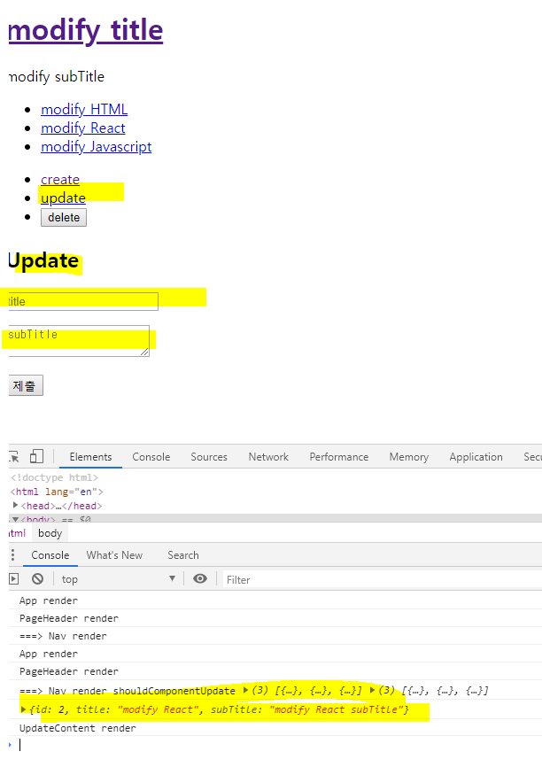

# Update와 Delete

## 업데이트 기능 구현
src/component/CreateContent.js를 복사하여 UpdateContent.js 로 생성한다.  
[UpdateContent.js]
```
import React, { Component } from 'react';

class UpdateContent extends Component {
    render() {
        console.log('UpdateContent render')
        return (
            <article>
              <h2>Update</h2>
              <form action="/create_process" method="post"
                onSubmit={function(e){
                  e.preventDefault();
                  this.props.onSubmit(
                    e.target.title.value,
                    e.target.subTitle.value
                  );
                  alert('Submit!!!!');
                }.bind(this)}
              >
                <p><input type="text" name="title" placeholder="title"></input></p>
                <p>
                    <textarea name="subTitle" placeholder="subTitle"></textarea>
                </p>
                <p>
                    <input type="submit"></input>
                </p>
              </form>
            </article>
        )
    }
}

export default UpdateContent;
```

App.js에서 UpdateContent를 사용하기 위해서 mode에 Update관련 로직을 추가를 해준다.  
[App.js]
```
import React, { Component } from 'react';
import PageNav from './components/PageNav';
import PageHeader from './components/PageHeader';
import ReadContent from './components/ReadContent';
import Control from './components/Control';
import CreateContent from './components/CreateContent';
import UpdateContent from './components/UpdateContent';
import './App.css';

class App extends Component {
  constructor(props) {
    super(props)
    this.max_content_id = 3;
    this.state = {
      mode:'create',
      selected_content_id:2,
      header: {title:'modify title', subTitle: 'modify subTitle'},
      contents:[
        {id:1, title:"modify HTML", subTitle:'modify HTML subTitle'},
        {id:2, title:"modify React", subTitle:'modify React subTitle'},
        {id:3, title:"modify Javascript", subTitle:'modify HTML Javascript'}
      ]
    }
  }
  render() {
    var _title, _subTitle, _article = null;
    if (this.state.mode === 'welcome') {
      _title = this.state.welcome.title;
      _subTitle = this.state.welcome.subTitle;
      _article = <ReadContent title={_title} contents={_subTitle}></ReadContent>
    } else if (this.state.mode === 'read') {
      var i = 0;
      while(i < this.state.contents.length) {
        var data = this.state.contents[i];
        if (data.id === this.state.selected_content_id) {
          _title = data.title;
          _subTitle = data.subTitle;
          break;
        }
        i = i + 1;
      }
      _article = <ReadContent title={_title} contents={_subTitle}></ReadContent>
    } else if (this.state.mode === 'create') {
      _article = <CreateContent onSubmit={function(_title, _subTitle) {
        this.max_content_id = this.max_content_id + 1;
        var _contents = this.state.contents.concat(
          {id:this.max_content_id, title:_title, subTitle:_subTitle}
        )
        this.setState({
          contents:_contents
        })
        console.log(_title, _subTitle)
      }.bind(this)}></CreateContent>
    } else if (this.state.mode === 'update') {
      _article = <UpdateContent onSubmit={function(_title, _subTitle) {
        this.max_content_id = this.max_content_id + 1;
        var _contents = this.state.contents.concat(
          {id:this.max_content_id, title:_title, subTitle:_subTitle}
        )
        this.setState({
          contents:_contents
        })
        console.log(_title, _subTitle)
      }.bind(this)}></UpdateContent>
    }
    return (
      <div className="App">
        <PageHeader 
          title={this.state.header.title} 
          subTitle={this.state.header.subTitle}
          onChangePage={function(){
            this.setState({mode: 'welcome'});
          }.bind(this)}
        ></PageHeader>
        <PageNav 
          onChangePage={function(id){
            this.setState({
              mode:'read',
              selected_content_id:Number(id)
            });
          }.bind(this)}
          data={this.state.contents}
        ></PageNav>
        <Control onChangeMode={function(_mode){
          this.setState({
            mode:_mode
          })
        }.bind(this)}></Control>
        {_article}
      </div>
    );
  }
}

export default App;
```

App.js의 중복코드를 getContent라는 함수로 쪼개서 render 함수쪽을 간결하게 만들어보자.  
[App.js]
```
import React, { Component } from 'react';
import PageNav from './components/PageNav';
import PageHeader from './components/PageHeader';
import ReadContent from './components/ReadContent';
import Control from './components/Control';
import CreateContent from './components/CreateContent';
import UpdateContent from './components/UpdateContent';
import './App.css';

class App extends Component {
  constructor(props) {
    super(props)
    this.max_content_id = 3;
    this.state = {
      mode:'create',
      selected_content_id:2,
      header: {title:'modify title', subTitle: 'modify subTitle'},
      contents:[
        {id:1, title:"modify HTML", subTitle:'modify HTML subTitle'},
        {id:2, title:"modify React", subTitle:'modify React subTitle'},
        {id:3, title:"modify Javascript", subTitle:'modify HTML Javascript'}
      ]
    }
  }
  getContent() {
    var _title, _subTitle, _article = null;

    if (this.state.mode === 'welcome') {
      _title = this.state.welcome.title;
      _subTitle = this.state.welcome.subTitle;
      _article = <ReadContent title={_title} contents={_subTitle}></ReadContent>
    } else if (this.state.mode === 'read') {
      var i = 0;
      while(i < this.state.contents.length) {
        var data = this.state.contents[i];
        if (data.id === this.state.selected_content_id) {
          _title = data.title;
          _subTitle = data.subTitle;
          break;
        }
        i = i + 1;
      }
      _article = <ReadContent title={_title} contents={_subTitle}></ReadContent>
    } else if (this.state.mode === 'create') {
      _article = <CreateContent onSubmit={function(_title, _subTitle) {
        this.max_content_id = this.max_content_id + 1;
        var _contents = this.state.contents.concat(
          {id:this.max_content_id, title:_title, subTitle:_subTitle}
        )
        this.setState({
          contents:_contents
        })
        console.log(_title, _subTitle)
      }.bind(this)}></CreateContent>
    } else if (this.state.mode === 'update') {
      _article = <UpdateContent onSubmit={function(_title, _subTitle) {
        this.max_content_id = this.max_content_id + 1;
        var _contents = this.state.contents.concat(
          {id:this.max_content_id, title:_title, subTitle:_subTitle}
        )
        this.setState({
          contents:_contents
        })
        console.log(_title, _subTitle)
      }.bind(this)}></UpdateContent>
    }

    return _article
  }
  render() {
  console.log('App render')
    return (
      <div className="App">
        <PageHeader 
          title={this.state.header.title} 
          subTitle={this.state.header.subTitle}
          onChangePage={function(){
            this.setState({mode: 'welcome'});
          }.bind(this)}
        ></PageHeader>
        <PageNav 
          onChangePage={function(id){
            this.setState({
              mode:'read',
              selected_content_id:Number(id)
            });
          }.bind(this)}
          data={this.state.contents}
        ></PageNav>
        <Control onChangeMode={function(_mode){
          this.setState({
            mode:_mode
          })
        }.bind(this)}></Control>
        {this.getContent()}
      </div>
    );
  }
}

export default App;
```

UpdateContent Component가 실행될때 선택된 content id값의 component데이터를 UpdateContent Component에 주입시켜보자.  
[App.js]
```
import React, { Component } from 'react';
import PageNav from './components/PageNav';
import PageHeader from './components/PageHeader';
import ReadContent from './components/ReadContent';
import Control from './components/Control';
import CreateContent from './components/CreateContent';
import UpdateContent from './components/UpdateContent';
import './App.css';

class App extends Component {
  constructor(props) {
    super(props)
    this.max_content_id = 3;
    this.state = {
      mode:'create',
      selected_content_id:2,
      header: {title:'modify title', subTitle: 'modify subTitle'},
      contents:[
        {id:1, title:"modify HTML", subTitle:'modify HTML subTitle'},
        {id:2, title:"modify React", subTitle:'modify React subTitle'},
        {id:3, title:"modify Javascript", subTitle:'modify HTML Javascript'}
      ]
    }
  }
  getReadContent() {
    var i = 0;
    while(i < this.state.contents.length) {
      var data = this.state.contents[i];
      if (data.id === this.state.selected_content_id) {
        return data;
      }
      i = i + 1;
    }
  }
  getContent() {
    var _title, _subTitle, _article = null;

    if (this.state.mode === 'welcome') {
      _title = this.state.welcome.title;
      _subTitle = this.state.welcome.subTitle;
      _article = <ReadContent title={_title} contents={_subTitle}></ReadContent>
    } else if (this.state.mode === 'read') {
      /*
        1. getReadContent 함수 생성 후 mode === read 였던 로직을 옮긴다.
        2. this.getReadContent(); 함수를 해당 조건 위치에 작성하고 _content 변수에 담는다.
        3. _content 변수는 this.getReadContent(); 함수의 return 받은 data를 갖고 있으므로 
           _article 변수에 들어갈 ReadContent Component에 title과 contents에 주입한다.
      */
      var _content = this.getReadContent(); 
      _article = <ReadContent title={_content.title} contents={_content.subTitle}></ReadContent>
    } else if (this.state.mode === 'create') {
      _article = <CreateContent onSubmit={function(_title, _subTitle) {
        this.max_content_id = this.max_content_id + 1;
        var _contents = this.state.contents.concat(
          {id:this.max_content_id, title:_title, subTitle:_subTitle}
        )
        this.setState({
          contents:_contents
        })
        console.log(_title, _subTitle)
      }.bind(this)}></CreateContent>
    } else if (this.state.mode === 'update') {
      /*
        1. this.getReadContent(); 함수를 해당 조건 위치에 작성하고 _content 변수에 담는다.
        2. _content 변수는 this.getReadContent(); 함수의 return 받은 data를 갖고 있으므로 
           _article 변수에 들어갈 UpdateContent Component에 data에 주입한다.
      */
      _content = this.getReadContent();
      _article = <UpdateContent data={_content} onSubmit={function(_title, _subTitle) {
        this.max_content_id = this.max_content_id + 1;
        var _contents = this.state.contents.concat(
          {id:this.max_content_id, title:_title, subTitle:_subTitle}
        )
        this.setState({
          contents:_contents
        })
        console.log(_title, _subTitle)
      }.bind(this)}></UpdateContent>
    }

    return _article
  }
  render() {
  console.log('App render')
    return (
      <div className="App">
        <PageHeader 
          title={this.state.header.title} 
          subTitle={this.state.header.subTitle}
          onChangePage={function(){
            this.setState({mode: 'welcome'});
          }.bind(this)}
        ></PageHeader>
        <PageNav 
          onChangePage={function(id){
            this.setState({
              mode:'read',
              selected_content_id:Number(id)
            });
          }.bind(this)}
          data={this.state.contents}
        ></PageNav>
        <Control onChangeMode={function(_mode){
          this.setState({
            mode:_mode
          })
        }.bind(this)}></Control>
        {this.getContent()}
      </div>
    );
  }
}

export default App;
```

[UpdateContent.js]  
```
import React, { Component } from 'react';

class UpdateContent extends Component {
    render() {
        console.log(this.props.data); // UpdateContent에 data가 잘 주입되었는지 console로 찍어본다.
        console.log('UpdateContent render');
        return (
            <article>
              <h2>Update</h2>
              <form action="/create_process" method="post"
                onSubmit={function(e){
                  e.preventDefault();
                  this.props.onSubmit(
                    e.target.title.value,
                    e.target.subTitle.value
                  );
                  alert('Submit!!!!');
                }.bind(this)}
              >
                <p><input type="text" name="title" placeholder="title"></input></p>
                <p>
                    <textarea name="subTitle" placeholder="subTitle"></textarea>
                </p>
                <p>
                    <input type="submit"></input>
                </p>
              </form>
            </article>
        )
    }
}

export default UpdateContent;
```

그 다음 페이지에서 update를 클릭하고 console.log를 출력하면 UpdateContent에 주입된 데이터를 확인할 수 있다.  



## UpdateContent Compoent에 주입된 데이터로 내용을 세팅해보자.
참고: [Form Document](https://reactjs.org/docs/forms.html)  
UpdateContent Compoent에 props로 들어온 데이터를 state를 만들고 form과 동기화시킨다.

UpdateContent의 데이터를 내용에 세팅하는 코드를 작성하자.  
[UpdateContent.js]
```
import React, { Component } from 'react';

class UpdateContent extends Component {
    // 가변적인 데이터를 state화 시켜준다.
    constructor(props) {
      super(props);
      this.state = {
        title:this.props.data.title,
        subTitle:this.props.data.subTitle
      }
    }

    render() {
        console.log(this.props.data);
        console.log('UpdateContent render');
        return (
            <article>
              <h2>Update</h2>
              <form action="/create_process" method="post"
                onSubmit={function(e){
                  e.preventDefault();
                  this.props.onSubmit(
                    e.target.title.value,
                    e.target.subTitle.value
                  );
                  alert('Submit!!!!');
                }.bind(this)}
              >
                <p>
                  <input 
                    type="text" 
                    name="title" 
                    placeholder="title"
                    // 추가
                    value={this.state.title}
                    // 내용을 동적으로 바꾸기 위해 onChange 함수를 추가하자.
                    onChange={function(e){
                      this.setState({title:e.target.value});
                    }.bind(this)}
                    ></input>
                </p>
                <p>
                    <textarea 
                      name="subTitle" 
                      placeholder="subTitle"
                      // 추가
                      value={this.state.subTitle}
                      // 내용을 동적으로 바꾸기 위해 onChange 함수를 추가하자.
                      onChange={function(e){
                        this.setState({subTitle:e.target.value});
                      }.bind(this)}
                    ></textarea>
                </p>
                <p>
                    <input type="submit"></input>
                </p>
              </form>
            </article>
        )
    }
}

export default UpdateContent;
```

UpdateContent Component의 공통 코드인 onChange 내용을 함수로 만들어 간결하게 만들어주자.  
[UpdateContent.js]
```
import React, { Component } from 'react';

class UpdateContent extends Component {
    // 가변적인 데이터를 state화 시켜준다.
    constructor(props) {
      super(props);
      this.state = {
        title:this.props.data.title,
        subTitle:this.props.data.subTitle
      }
      // bind를 생성자에 선언하여 공통화 시킨다. 즉, 미리 bind된걸로 변경해준다.
      this.inputFormHandler = this.inputFormHandler.bind(this);
    }
    // 중복제거
    inputFormHandler(e) {
      this.setState({[e.target.name]:e.target.value});
    }
    render() {
        console.log(this.props.data);
        console.log('UpdateContent render');
        return (
            <article>
              <h2>Update</h2>
              <form action="/create_process" method="post"
                onSubmit={function(e){
                  e.preventDefault();
                  this.props.onSubmit(
                    e.target.title.value,
                    e.target.subTitle.value
                  );
                  alert('Submit!!!!');
                }.bind(this)}
              >
                <p>
                  <input 
                    type="text" 
                    name="title" 
                    placeholder="title"
                    value={this.state.title}
                    // 중복 코드 제거
                    onChange={this.inputFormHandler}
                    ></input>
                </p>
                <p>
                    <textarea 
                      name="subTitle" 
                      placeholder="subTitle"
                      value={this.state.subTitle}
                      // 중복 코드 제거
                      onChange={this.inputFormHandler}
                    ></textarea>
                </p>
                <p>
                    <input type="submit"></input>
                </p>
              </form>
            </article>
        )
    }
}

export default UpdateContent;
```


## UpdateContent Compoent에 식별자 생성
id 식별자 추가하고 onSubmit에 id값을 추가한다.  
[UpdateContent.js]
```
import React, { Component } from 'react';

class UpdateContent extends Component {
    constructor(props) {
      super(props);
      this.state = {
        title:this.props.data.title,
        subTitle:this.props.data.subTitle
      }
      this.inputFormHandler = this.inputFormHandler.bind(this);
    }
    inputFormHandler(e) {
      this.setState({[e.target.name]:e.target.value});
    }
    render() {
        console.log(this.props.data);
        console.log('UpdateContent render');
        return (
            <article>
              <h2>Update</h2>
              <form action="/create_process" method="post"
                onSubmit={function(e){
                  e.preventDefault();
                  // onSubmit에 id값을 추가하고 어차피 동기화가 되기때문에 title, subTitle도 this객체로 변경해준다.
                  this.props.onSubmit(
                    this.state.id,
                    this.state.title,
                    this.state.subTitle
                  );
                  alert('Submit!!!!');
                }.bind(this)}
              >
                {/* id 식별자 추가 */}
                <input type="hidden" name="id" value={this.state.id}></input>
                <p>
                  <input 
                    type="text" 
                    name="title" 
                    placeholder="title"
                    value={this.state.title}
                    onChange={this.inputFormHandler}
                    ></input>
                </p>
                <p>
                    <textarea 
                      name="subTitle" 
                      placeholder="subTitle"
                      value={this.state.subTitle}
                      onChange={this.inputFormHandler}
                    ></textarea>
                </p>
                <p>
                    <input type="submit"></input>
                </p>
              </form>
            </article>
        )
    }
}

export default UpdateContent;
```

App.js의 UpdateContent에서 onSubmit이 실행될 때 코드를 변경하자.  
[App.js]
```
import React, { Component } from 'react';
import PageNav from './components/PageNav';
import PageHeader from './components/PageHeader';
import ReadContent from './components/ReadContent';
import Control from './components/Control';
import CreateContent from './components/CreateContent';
import UpdateContent from './components/UpdateContent';
import './App.css';

class App extends Component {
  constructor(props) {
    super(props)
    this.max_content_id = 3;
    this.state = {
      mode:'create',
      selected_content_id:2,
      header: {title:'modify title', subTitle: 'modify subTitle'},
      contents:[
        {id:1, title:"modify HTML", subTitle:'modify HTML subTitle'},
        {id:2, title:"modify React", subTitle:'modify React subTitle'},
        {id:3, title:"modify Javascript", subTitle:'modify HTML Javascript'}
      ]
    }
  }
  getReadContent() {
    var i = 0;
    while(i < this.state.contents.length) {
      var data = this.state.contents[i];
      if (data.id === this.state.selected_content_id) {
        return data;
      }
      i = i + 1;
    }
  }
  getContent() {
    var _title, _subTitle, _article = null;

    if (this.state.mode === 'welcome') {
      _title = this.state.welcome.title;
      _subTitle = this.state.welcome.subTitle;
      _article = <ReadContent title={_title} contents={_subTitle}></ReadContent>
    } else if (this.state.mode === 'read') {
      var _content = this.getReadContent(); 
      _article = <ReadContent title={_content.title} contents={_content.subTitle}></ReadContent>
    } else if (this.state.mode === 'create') {
      _article = <CreateContent onSubmit={function(_title, _subTitle) {
        this.max_content_id = this.max_content_id + 1;
        var _contents = Array.from(this.state.contents);
        this.setState({
          contents:_contents,
          mode:'read',
          selected_content_id:this.max_content_id
        })
      }.bind(this)}></CreateContent>
    } else if (this.state.mode === 'update') {
     _content = this.getReadContent();
      _article = <UpdateContent data={_content} onSubmit={
        // 변경
        function(_id, _title, _subTitle) {
          var _contents = Array.from(this.state.contents);
          _contents.push({id:this.max_content_id, title:_title, subTitle:_subTitle});
          var i = 0;
          while(i < _contents.length) {
            if (_contents[i].id === _id) {
              _contents[i] = {id:_id, title:_title, subTitle:_subTitle};
              break;
            }
            i = i + 1;
          }
          // 변경
          this.setState({
            contents:_contents,
            mode:'read'
          })
      }.bind(this)}></UpdateContent>
    }

    return _article
  }
  render() {
  console.log('App render')
    return (
      <div className="App">
        <PageHeader 
          title={this.state.header.title} 
          subTitle={this.state.header.subTitle}
          onChangePage={function(){
            this.setState({mode: 'welcome'});
          }.bind(this)}
        ></PageHeader>
        <PageNav 
          onChangePage={function(id){
            this.setState({
              mode:'read',
              selected_content_id:Number(id)
            });
          }.bind(this)}
          data={this.state.contents}
        ></PageNav>
        <Control onChangeMode={function(_mode){
          this.setState({
            mode:_mode
          })
        }.bind(this)}></Control>
        {this.getContent()}
      </div>
    );
  }
}

export default App;
```


## Delete 구현
Delete 기능을 구현해보자. Delete 버튼은 Control Component에 위치한다.  
  
[App.js]
```
import React, { Component } from 'react';
import PageNav from './components/PageNav';
import PageHeader from './components/PageHeader';
import ReadContent from './components/ReadContent';
import Control from './components/Control';
import CreateContent from './components/CreateContent';
import UpdateContent from './components/UpdateContent';
import './App.css';

class App extends Component {
  constructor(props) {
    super(props)
    this.max_content_id = 3;
    this.state = {
      mode:'welcome',
      selected_content_id:2,
      header: {title:'modify title', subTitle: 'modify subTitle'},
      contents:[
        {id:1, title:"modify HTML", subTitle:'modify HTML subTitle'},
        {id:2, title:"modify React", subTitle:'modify React subTitle'},
        {id:3, title:"modify Javascript", subTitle:'modify HTML Javascript'}
      ]
    }
  }
  getReadContent() {
    var i = 0;
    while(i < this.state.contents.length) {
      var data = this.state.contents[i];
      if (data.id === this.state.selected_content_id) {
        return data;
        break;
      }
      i = i + 1;
    }
  }
  getContent() {
    var _title, _subTitle, _article = null;

    if (this.state.mode === 'welcome') {
      _title = this.state.header.title;
      _subTitle = this.state.header.subTitle;
      _article = <ReadContent title={_title} contents={_subTitle}></ReadContent>
    } else if (this.state.mode === 'read') {
      var _content = this.getReadContent(); 
      _article = <ReadContent title={_content.title} contents={_content.subTitle}></ReadContent>
    } else if (this.state.mode === 'create') {
      _article = <CreateContent onSubmit={function(_title, _subTitle) {
        this.max_content_id = this.max_content_id+1;
        var _contents = Array.from(this.state.contents);
        _contents.push({id:this.max_content_id, title:_title, subTitle:_subTitle});
        this.setState({
          contents:_contents,
          mode:'read',
          selected_content_id:this.max_content_id
        })
      }.bind(this)}></CreateContent>
    } else if (this.state.mode === 'update') {
     _content = this.getReadContent();
      _article = <UpdateContent data={_content} onSubmit={
        function(_id, _title, _subTitle) {
          var _contents = Array.from(this.state.contents);
          var i = 0;
          while(i < _contents.length) {
            if (_contents[i].id === _id) {
              _contents[i] = {id:_id, title:_title, subTitle:_subTitle};
              break;
            }
            i = i + 1;
          }
          this.setState({
            contents:_contents,
            mode:'read'
          })
      }.bind(this)}></UpdateContent>
    }

    return _article
  }
  render() {
  console.log('App render')
    return (
      <div className="App">
        <PageHeader 
          title={this.state.header.title} 
          subTitle={this.state.header.subTitle}
          onChangePage={function(){
            this.setState({mode: 'welcome'});
          }.bind(this)}
        ></PageHeader>
        <PageNav 
          onChangePage={function(id){
            this.setState({
              mode:'read',
              selected_content_id:Number(id)
            });
          }.bind(this)}
          data={this.state.contents}
        ></PageNav>
        <Control onChangeMode={function(_mode){
          // 변경
          if (_mode === 'delete') {
            if (window.confirm('정말 삭제하시겠습니까?')) {
              // 데이터 삭제
              var _contents = Array.from(this.state.contents);
              var i = 0;
              while (i < this.state.contents.length) {
                if (_contents[i].id === this.state.selected_content_id) {
                  // 발견한 원소의 id값 부터 1개를 지우고 원본을 변경
                  _contents.splice(i, 1);
                  break;
                }
                i = i + 1;
              }
              this.setState({
                mode: 'welcome',
                contents: _contents
              })
              alert('삭제가 완료되었습니다.');
            }
          } else {
            this.setState({
              mode:_mode
            })
          }
        }.bind(this)}></Control>
        {this.getContent()}
      </div>
    );
  }
}

export default App;
```

결과 페이지에서 delete 버튼을 클릭하면 삭제된 내용을 확인할 수 있다.

## 완성코드
[react-app-example-6](https://github.com/bkjeon1614/javascript-study/tree/master/reactjs/study/base/react-app-example-6)


## 참고
inflearn.com/course/react-생활코딩#
