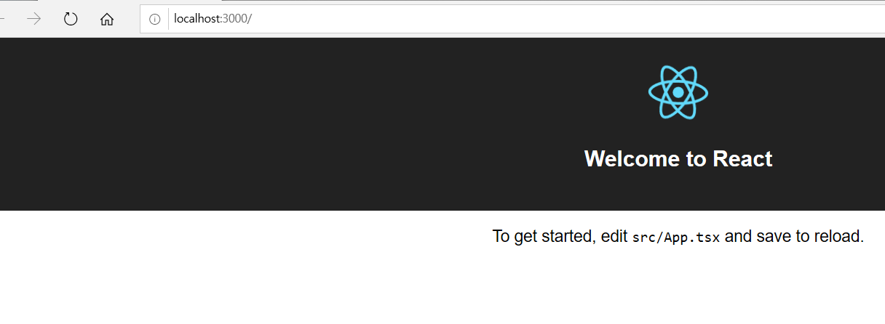

# React 프로젝트 생성

## Create React App
Create React App은 React의 작업 환경을 자동으로 구축해준다. Dan Abamov가 만들었다(Redux를 만든사람으로 유명하다)
- 프로젝트 생성
  - create-react-app {프로젝트명}
- 개발 서버 실행
  - npm run start
- 프로덕션 빌드
  - npm run build
- 테스트
  - npm run test
- 프로젝트의 구조가 바뀜(ex:위험도가 높으므로 사용을 지양)
  - npm run eject
- pwa(Progressive Web App) 적용  
  

## Create React App 설치
### create-react-app global 설치
```
npm i create-react-app -g
```
```
// create-react-app {프로젝트명} 으로 설치
// .은 현재경로에 설치한다는 뜻
// typescript를 할꺼므로 --scripts-version=react-scripts-ts 를 추가한다.
create-react-app . --scripts-version=react-scripts-ts
```

### 실행을 하면 아래와 같이 페이지가 표시되면 성공
```
yarn start
```


### 테스트 방법
```
yarn run test   // create-react-app에 watch 모드가 기본적으로 설정되어있다.
```

### 빌드 방법
```
yarn run build
```
위의 명령을 실행하면 프로젝트 폴더에 build/ 폴더가 생성되어 해당 경로에 소스가 배포된다.

### 디렉토리 구조
디렉토리 구조 설명
```
    react-typescript-app-example-2
    ├── node_modules
    ├── public
    │    └── index.html
    │    └── favicon.ico
    │    └── manifest.json
    ├── src
    │    └── App.css
    │    └── App.test.tsx
    │    └── App.tsx
    │    └── index.css
    │    └── index.tsx  // webpack의 진입로
    │    └── logo.svg
    │    └── registerServiceWorker.ts
    ├── .gitignore
    ├── package.json
    ├── README.md
    ├── tsconfig.json
    ├── tslint.json
    └── yarn.lock
```
index.tsx
- 메인 엔트리 파일
- 꼭대기에서 ReactDom.render를 수행
- pwa를 위한 서비스 워커 등록 작업
index.css
- 글로벌 스타일 작성 (아무곳에서나 써도 사용이 가능하다.)
App.tsx
- App 컴포넌트(샘플 컴포넌트)
- 클래스명과 파일명을 맞추는 것이 관례
App.css
- App 컴포넌트에서만 쓰이는 스타일
App.test.tsx
- App 컴포넌트에 대한 테스트 작성 파일
registerServiceWorker.ts
- pwa 서비스 워커 사용 등록

ts-loader => tsconfig.json 설명
[tsconfig.json]
```
{
  "compilerOptions": {
    "baseUrl": ".",
    "outDir": "build/dist", // 빌드 결과물 폴더
    "module": "esnext", // 빌드 결과의 모듈 방식은 common.js
    "target": "es5",    // 빌드 결과물은 es5 방식
    "lib": ["es6", "dom"],  // 라이브러리는 es6과 dom
    "sourceMap": true,  // .map.js 파일도 함께 생성
    "allowJs": true,    // JS 파일도 컴파일 대상
    "jsx": "react", // JSX 구문 사용 가능(ts구문을 인식하기 위해서 jsx에 react를 썼다.)
    "moduleResolution": "node", // 모듈 해석 방식은 node 처럼
    "rootDir": "src",   // 컴파일할 대상들이 들어있느 폴더(루트폴더)
    "forceConsistentCasingInFileNames": true,   // import할때 모듈명이 하나는 대문자로 시작하고 다른 하나는 소문자로 시작할때 모듈을 읽어오는데 문제가 생긴다. 그래서 true로 한다. (https://github.com/TypeStrong/ts-loader/issue/89)
    "noImplicitReturns": true,  // 제대로 리턴 다 안되면 에러
    "noImplicitThis": true, // this 표현식에 암시적으로 any로 추론되면
    "noImplicitAny": true,  // 암시적으로 선언되었는데 any로 추론되면
    "importHelpers": true,
    "strictNullChecks": true,   // null이나 undefined를 서브타입으로 사용하지 못하게 함(즉, null 될 수도 있으면 반드시 타입에 표시해줘야한다.)
    "suppressImplicitAnyIndexErrors": true, // 인덱싱 시그니처가 없는 경우(ex: [key: string]: any), 인덱스를 사용했을때 noImplicitAny 에 의해 에러가 뜨는것을 예외로함
    "noUnusedLocals": true  // 사용 안하는 로컬 변수가 있으면 에러
  },
  "exclude": [
    "node_modules",
    "build",
    "scripts",
    "acceptance-tests",
    "webpack",
    "jest",
    "src/setupTests.ts"
  ]
}
```

[index.tsx]
```
import * as React from 'react';
import * as ReactDOM from 'react-dom';
import App from './App';
import './index.css';
import registerServiceWorker from './registerServiceWorker';

// 
ReactDOM.render(
  <App />,
  // id가 root인 dom에다가 app이라는 컴포넌트를 render -> 즉, App 하위에 있는 컴포넌트를 다 실행함
  document.getElementById('root') as HTMLElement
);
registerServiceWorker();
```

[App.tsx]
```
import * as React from 'react';
import './App.css';

import logo from './logo.svg';

// App이라는 컴포넌트 안에 render라는 함수를 구현한것이다.
class App extends React.Component {
  public render() {
    return (
      <div className="App">
        <header className="App-header">
          
          <h1 className="App-title">Welcome to React</h1>
        </header>
        <p className="App-intro">
          To get started, edit <code>src/App.tsx</code> and save to reload.
        </p>
      </div>
    );
  }
}

export default App;
```


## 참조
https://www.inflearn.com/course/react-with-typescript#