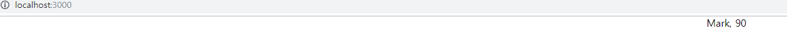
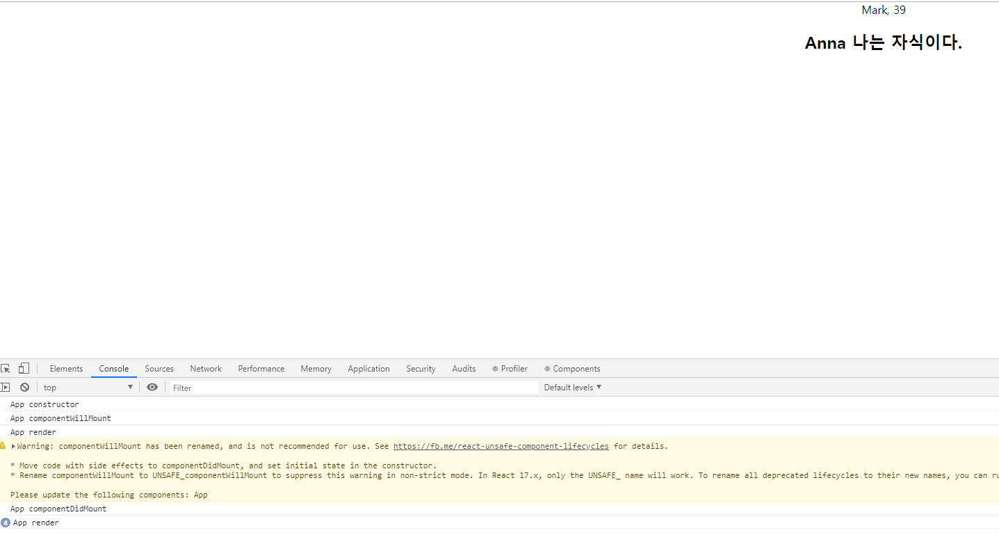

# Component

## Props, State
Props
- 컴포넌트 외부에서 컴포넌트로 넣어주는 데이터(함수도 가능)
- 컴포넌트 내부에서는 자신의 props를 변경할 수 없다.
  - 물론 돌아가면 가능은 하다.
- 컴포넌트 외부에서 props 데이터를 변경하면, render가 다시 호출된다.
State
- 컴포넌트 내부의 데이터
- 클래스의 프로퍼티와는 다르다.
  - 프로퍼티는 변경한다고 render가 호출되지 않는다.
- 생성자 혹은 프로퍼티 초기 할당으로 state를 초기 할당 해줘야 한다.
- 내부에서 변경을 하더라도 setState 함수를 이용해야 render가 호출된다.

초기 세팅시 주의할 점(state 초기 할당 관련)
[index.tsx]
```
import * as React from 'react';
import * as ReactDOM from 'react-dom';
import App from './App';
import './index.css';
import registerServiceWorker from './registerServiceWorker';

ReactDOM.render(
  // props를 세팅한다.
  <App name="Mark" />,
  document.getElementById('root') as HTMLElement
);
registerServiceWorker();
```

[App.tsx]
```
import * as React from 'react';
import './App.css';

// props와 state를 선언(props:name, state:age)
class App extends React.Component<{ name: string; }, { age: number; }> {
  // 아래 코드는 그 아래에 생성자(=constructor)를 선언한 것 과 똑같다. 둘중 하나로 선언해주면됨
  // public state: { age: number; } = {
  //   age: 35
  // };
  constructor(props: {name: string;}) {
    super(props);
    this.state = {
      age: 35
    }
  }
  public render() {
    return (
      <div className="App">
        {this.props.name}, {this.state.age}
      </div>
    );
  }
}

export default App;
```

setState 사용 방법
[App.tsx]
```
import * as React from 'react';
import './App.css';

class App extends React.Component<{ name: string; }, { age: number; }> {
  constructor(props: {name: string;}) {
    super(props);
    this.state = {
      age: 35
    };
    // 해당 코드는 2초에 age를 1씩 더해준다. 즉, setState를 지정했을때만 render를 다시 호출하는것을 볼 수 있다.
    setInterval(() => {
      this.setState({
        age: this.state.age + 1
      });
    }, 2000);
  }
  public render() {
    return (
      <div className="App">
        {this.props.name}, {this.state.age}
      </div>
    );
  }
}

export default App;
```


위의 App.tsx를 간략하게 만들자.(선언한 props를 interface 지정)
```
import * as React from 'react';
import './App.css';

// ts 3.x 부터는 tslint가 모든 인터페이스 네이밍 앞에 대문자 I를 강제한다.
interface IAppProps {
  name: string;
}

interface IAppState {
  age: number;
}

class App extends React.Component<IAppProps, IAppState> {
  constructor(props: IAppProps) {
    super(props);
    this.state = {
      age: 35
    };
    setInterval(() => {
      this.setState({
        age: this.state.age + 1
      });
    }, 2000);
  }
  public render() {
    return (
      <div className="App">
        {this.props.name}, {this.state.age}
        <StatelessComponent name="Anna">나는 자식이다.</StatelessComponent>
      </div>
    );
  }
}

const StatelessComponent: React.SFC<IAppProps> = (props) => {
  return (
    <h2>{props.name} {props.children}</h2>
  );
}

export default App;
```
  

> 위의 코드를 보면 StatelessComponent 태그 안에 "나는 자식이다."를 출력하려면 props.children을 쓰면 된다는것을 확인할 수 있다.


## Lifecycle
원활한 개발 환경을 위하여 tslint 설정값을 수정하자.
[tslint.json]
```
{
  "extends": ["tslint:recommended", "tslint-react", "tslint-config-prettier"],
  "linterOptions": {
    "exclude": [
      "config/**/*.js",
      "node_modules/**/*.ts",
      "coverage/lcov-report/*.js"
    ]
  },
  "rules": {
    "no-console": false,  // console.log 사용
    "member-access": [true, "no-public"]  // 접근제어자 관련 설정
  }
}
```

Lifecycle을 확인하기 위하여 코드 추가  
[App.tsx]
```
import * as React from 'react';
import './App.css';

interface IAppProps {
  name: string;
}

interface IAppState {
  age: number;
}

class App extends React.Component<IAppProps, IAppState> {
  constructor(props: IAppProps) {
    // 추가
    console.log('App constructor');
    super(props);
    this.state = {
      age: 35
    };
    setInterval(() => {
      this.setState({
        age: this.state.age + 1
      });
    }, 2000);
  }

  // ---------------------- 추가 ----------------------
  componentWillMount() {
    console.log('App componentWillMount');
  }
  componentDidMount() {
    console.log('App componentDidMount');
  }
  componentWillUnmount() {
    console.log('App componentWillUnmount');
  }
  // ---------------------- 추가 끝 ----------------------

  render() {
    // 추가
    console.log('App render')
    return (
      <div className="App">
        {this.props.name}, {this.state.age}
        <StatelessComponent name="Anna">나는 자식이다.</StatelessComponent>
      </div>
    );
  }
}

const StatelessComponent: React.SFC<IAppProps> = (props) => {
  return (
    <h2>{props.name} {props.children}</h2>
  );
}

export default App;
```

위의 이미지의 console.log를 확인해보면 lifecycle을 확인할 수 있다.  

> 여기서 일반적으로 state를 설정할 때 빼고는 constructor에다가 다음 행동을 적어놓지 않는다. 왜냐하면 constructor는 제일 초반에 불려오기 때문에 마운트가 된 다음에 일을 진행시키는게 더 일반적이라고 한다. 그러한 점을 고려해서 render가 다 됬을 때 setInterval을 돌려보도록 코드를 수정하자.  
[App.tsx]
```
import * as React from 'react';
import './App.css';

interface IAppProps {
  name: string;
}

interface IAppState {
  age: number;
}

class App extends React.Component<IAppProps, IAppState> {
  constructor(props: IAppProps) {
    // 추가
    console.log('App constructor');
    super(props);
    this.state = {
      age: 35
    };
  }

  // ---------------------- 추가 ----------------------
  componentWillMount() {
    console.log('App componentWillMount');
  }
  componentDidMount() {
    // 보통 여기서 초기 세팅을 할 경우에 선언한다.(ex:api..)
    console.log('App componentDidMount');
    setInterval(() => {
      this.setState({
        age: this.state.age + 1
      });
    }, 2000);
  }
  componentWillUnmount() {
    // 주로 작업해주는걸 제거할때 사용(위에 setInterval같은 경우도 제거를 안해주면 계속 실행되어 메모리누수가 발생한다.)
    console.log('App componentWillUnmount');
  }
  // ---------------------- 추가 끝 ----------------------

  render() {
    // 추가
    console.log('App render')
    return (
      <div className="App">
        {this.props.name}, {this.state.age}
        <StatelessComponent name="Anna">나는 자식이다.</StatelessComponent>
      </div>
    );
  }
}

const StatelessComponent: React.SFC<IAppProps> = (props) => {
  return (
    <h2>{props.name} {props.children}</h2>
  );
}

export default App;
```
> 즉 Component의 생성 및 마운트 순서는 Constructor -> ComponentWillMount -> Render -> ComponentDidMount

Component props, state 변경
```
import * as React from 'react';
import './App.css';

interface IAppProps {
  name: string;
}

interface IAppState {
  age: number;
}

class App extends React.Component<IAppProps, IAppState> {
  constructor(props: IAppProps) {
    console.log('App constructor');
    super(props);
    this.state = {
      age: 35
    };
  }

  componentWillMount() {
    console.log('App componentWillMount');
  }
  componentDidMount() {
    console.log('App componentDidMount');
    setInterval(() => {
      this.setState({
        age: this.state.age + 1
      });
    }, 2000);
  }
  componentWillUnmount() {
    console.log('App componentWillUnmount');
  }
  // ---------------------- 추가 ----------------------
  // props를 새로 지정했을 때 바로 호출된다.
  // state의 변경에 반응하지 않는다.(변경하려면 setState를 사용. -> 그러면 다음 이벤트로 각각 가는것이 아니라 한번에 변경됨)
  componentWillReceiveProps(nextProps: IAppProps) {
    console.log(`App componentWillReceiveProps: + ${JSON.stringify(nextProps)}`);
  }
  // props만 변경되어도(ex: componentWillReceiveProps -> shouldComponentUpdate 순서), state만 변경되어도(ex: 바로 shouldComponentUpdate 함수로 넘어옴), props & state 둘다 변경되어도 newProps와 newState를 인자로해서 호출
  // shouldComponentUpdate는 return값을 false로 할 경우에는 render가 일어나지 않는다. (디폴트는 true)
  shouldComponentUpdate(nextProps: IAppProps, nextState: IAppState) {
    console.log(`App shouldComponentUpdate: + ${JSON.stringify(nextProps)}, ${JSON.stringify(nextState)}`);
    return true;
  }
  // 컴포넌트가 재 랜더링 되기 직전에 불린다.
  // 위의 shouldComponentUpdate가 true가 되어야 호출되는걸 확인할 수 있다.
  // 여기선 setState 같은 것을 쓰면 안된다.
  componentWillUpdate(nextProps: IAppProps, nextState: IAppState) {
    console.log(`App componentWillUpdate: + ${JSON.stringify(nextProps)}, ${JSON.stringify(nextState)}`);
  }
  // 컴포넌트가 재 랜더링을 마치면 불린다.
  componentDidUpdate(prevProps: IAppProps, prevState: IAppState) {
    console.log(`App componentDidUpdate: + ${JSON.stringify(prevProps)}, ${JSON.stringify(prevState)}`);
  }
  // ---------------------- 추가 끝 ----------------------

  render() {
    console.log('App render')
    return (
      <div className="App">
        {this.props.name}, {this.state.age}
        <StatelessComponent name="Anna">나는 자식이다.</StatelessComponent>
      </div>
    );
  }
}

const StatelessComponent: React.SFC<IAppProps> = (props) => {
  return (
    <h2>{props.name} {props.children}</h2>
  );
}

export default App;
```

## Event
모든 Event는 카멜케이스로 작성되어야 한다.(ex: onClick ..)

버튼을 하나 만들어서 event가 실행되게하자.
[App.tsx]
```
import * as React from 'react';
import './App.css';

interface IAppProps {
  name: string;
}

interface IAppState {
  age: number;
}

class App extends React.Component<IAppProps, IAppState> {
  constructor(props: IAppProps) {
    console.log('App constructor');
    super(props);
    this.state = {
      age: 35
    };
    // scope 이슈 때문에 추가.
    this._rollback = this._rollback.bind(this);
  }

  componentWillMount() {
    console.log('App componentWillMount');
  }
  componentDidMount() {
    console.log('App componentDidMount');
    setInterval(() => {
      this.setState({
        age: this.state.age + 1
      });
    }, 2000);
  }
  componentWillUnmount() {
    console.log('App componentWillUnmount');
  }
  componentWillReceiveProps(nextProps: IAppProps) {
    console.log(`App componentWillReceiveProps: + ${JSON.stringify(nextProps)}`);
  }
  shouldComponentUpdate(nextProps: IAppProps, nextState: IAppState) {
    console.log(`App shouldComponentUpdate: + ${JSON.stringify(nextProps)}, ${JSON.stringify(nextState)}`);
    return true;
  }
  componentWillUpdate(nextProps: IAppProps, nextState: IAppState) {
    console.log(`App componentWillUpdate: + ${JSON.stringify(nextProps)}, ${JSON.stringify(nextState)}`);
  }
  componentDidUpdate(prevProps: IAppProps, prevState: IAppState) {
    console.log(`App componentDidUpdate: + ${JSON.stringify(prevProps)}, ${JSON.stringify(prevState)}`);
  }

  render() {
    console.log('App render')
    return (
      <div className="App">
        {this.props.name}, {this.state.age}
        <button onClick={this._rollback}>회춘</button>
        <StatelessComponent name="Anna">나는 자식이다.</StatelessComponent>
      </div>
    );
  }

  // 추가
  private _rollback() {
    this.setState({
      age: 25
    });
  }
}

const StatelessComponent: React.SFC<IAppProps> = (props) => {
  return (
    <h2>{props.name} {props.children}</h2>
  );
}

export default App;
```
위의 코드를 적용시키고 페이지에서 "회춘" 버튼을 클릭하면 25로 숫자가 변경되는것을 확인할 수 있다.

PropTypes란?
React.PropTypes를 더이상 함께 제공해 주지 않는다.
- 별도의 라이브러리로 분리하였으므로 사용자에게 선택의 폭을 준것이라고 생각된다.
종류
- 라이브러리로 제공되는 PropTypes
  - https://www.npmjs.com/package/prop-types
- Facebook에서 제공하는 Flow
  - https://flow.org/
- Typescript
  - https://www.typescriptlang.org

defaultProps 사용법(class)
[App.tsx]
```
import * as React from 'react';
import './App.css';

interface IAppProps {
  name: string;
  // 있을수도 있고 없을수도 있을 때 ?를 선언(즉, PropTypes 사용)
  company?: string;
}

interface IAppState {
  age: number;
}

class App extends React.Component<IAppProps, IAppState> {
  // company의 default값을 지정해준다.
  static defaultProps = {
    company: 'Studio XID'
  };
  constructor(props: IAppProps) {
    console.log('App constructor');
    super(props);
    this.state = {
      age: 35
    };
    // scope 이슈 때문에 추가.
    this._rollback = this._rollback.bind(this);
  }

  componentWillMount() {
    console.log('App componentWillMount');
  }
  componentDidMount() {
    console.log('App componentDidMount');
    setInterval(() => {
      this.setState({
        age: this.state.age + 1
      });
    }, 2000);
  }
  componentWillUnmount() {
    console.log('App componentWillUnmount');
  }
  componentWillReceiveProps(nextProps: IAppProps) {
    console.log(`App componentWillReceiveProps: + ${JSON.stringify(nextProps)}`);
  }
  shouldComponentUpdate(nextProps: IAppProps, nextState: IAppState) {
    console.log(`App shouldComponentUpdate: + ${JSON.stringify(nextProps)}, ${JSON.stringify(nextState)}`);
    return true;
  }
  componentWillUpdate(nextProps: IAppProps, nextState: IAppState) {
    console.log(`App componentWillUpdate: + ${JSON.stringify(nextProps)}, ${JSON.stringify(nextState)}`);
  }
  componentDidUpdate(prevProps: IAppProps, prevState: IAppState) {
    console.log(`App componentDidUpdate: + ${JSON.stringify(prevProps)}, ${JSON.stringify(prevState)}`);
  }

  render() {
    console.log('App render')
    return (
      <div className="App">
        {/* company 추가 */}
        {this.props.name}, {this.props.company}, {this.state.age}
        <button onClick={this._rollback}>회춘</button>
        <StatelessComponent name="Anna">나는 자식이다.</StatelessComponent>
      </div>
    );
  }

  // 추가
  private _rollback() {
    this.setState({
      age: 25
    });
  }
}

const StatelessComponent: React.SFC<IAppProps> = (props) => {
  return (
    <h2>{props.name} {props.children}</h2>
  );
}

export default App;
```

[index.tsx]
```
import * as React from 'react';
import * as ReactDOM from 'react-dom';
import App from './App';
import './index.css';
import registerServiceWorker from './registerServiceWorker';

ReactDOM.render(
  // 여기에 company값을 주입하면 주입한값으로 페이지에 표시된다.
  <App name="Mark" company="ProtoPie" />,
  document.getElementById('root') as HTMLElement
);
registerServiceWorker();
```


defaultProps 사용법(function)
[App.tsx]
StatelessComponent에 defaultProps값을 추가해보자.
```
import * as React from 'react';
import './App.css';

interface IAppProps {
  name: string;
  company?: string;
}

interface IAppState {
  age: number;
}

class App extends React.Component<IAppProps, IAppState> {
  static defaultProps = {
    company: 'Studio XID'
  };
  constructor(props: IAppProps) {
    console.log('App constructor');
    super(props);
    this.state = {
      age: 35
    };
    this._rollback = this._rollback.bind(this);
  }

  componentWillMount() {
    console.log('App componentWillMount');
  }
  componentDidMount() {
    console.log('App componentDidMount');
    setInterval(() => {
      this.setState({
        age: this.state.age + 1
      });
    }, 2000);
  }
  componentWillUnmount() {
    console.log('App componentWillUnmount');
  }
  componentWillReceiveProps(nextProps: IAppProps) {
    console.log(`App componentWillReceiveProps: + ${JSON.stringify(nextProps)}`);
  }
  shouldComponentUpdate(nextProps: IAppProps, nextState: IAppState) {
    console.log(`App shouldComponentUpdate: + ${JSON.stringify(nextProps)}, ${JSON.stringify(nextState)}`);
    return true;
  }
  componentWillUpdate(nextProps: IAppProps, nextState: IAppState) {
    console.log(`App componentWillUpdate: + ${JSON.stringify(nextProps)}, ${JSON.stringify(nextState)}`);
  }
  componentDidUpdate(prevProps: IAppProps, prevState: IAppState) {
    console.log(`App componentDidUpdate: + ${JSON.stringify(prevProps)}, ${JSON.stringify(prevState)}`);
  }

  render() {
    console.log('App render')
    return (
      <div className="App">
        {this.props.name}, {this.props.company}, {this.state.age}
        <button onClick={this._rollback}>회춘</button>
        <StatelessComponent name="Anna">나는 자식이다.</StatelessComponent>
      </div>
    );
  }

  private _rollback() {
    this.setState({
      age: 25
    });
  }
}

const StatelessComponent: React.SFC<IAppProps> = (props) => {
  return (
    <h2>{props.name}, {props.company}, {props.children}</h2>
  );
}

// 추가
StatelessComponent.defaultProps = {
  company: 'Home'
};

export default App;
```


defaultProps 사용법(function 2번째)
위의 1번째 예제의 StatelessComponent를 아래와 같이 변경해서 사용하는 방법도 있다.
```
  ...
  const StatelessComponent: React.SFC<IAppProps> = ({name, company = 'Home', children}) => {
    return (
      <h2>{name}, {company}, {children}</h2>
    );
  }

  export default App;
```


## Component 변경
button을 클릭하여 Grand Child를 변경하려면
```
    Grand Parent
    ├── Parent
    │     └── Me
    │         └── Child
    │               └── Grand Child
    ├── <button></button>
```
1. Grand Parent 컴포넌트에서 button에 onClick 이벤트를 생성
2. 클릭 후 Grand Parent의 state를 변경하고 Parent로 내려주는 props를 변경
3. parent의 props가 변경되면 Me의 props에 전달
4. Me의 props가 변경되면, Child의 props로 전달
5. Child의 props가 변경되면 Grand Child의 props로 전달

Grand Child를 클릭하여 p의 내용을 변경하려면
```
    Grand Parent
    ├── Parent
    │     └── Me
    │         └── Child
    │               └── Grand Child
    ├── <p></p>
```
1. Grand Parent 에서 함수를 만들고 그 함수 안에 state를 변경하도록 구현, 그 변경으로 인해 p안의 내용을 변경
2. 만들어진 함수를 props에 넣어서, parent로 전달
3. Parent의 props의 함수를 Me의 props로 전달
4. Me의 Props의 함수를 Child의 props로 전달
5. Child의 props의 함수를 Grand Child의 props로 전달

> 위와 같이 이러한 과정들 때문에 컴포넌트가 많아짐에 따라 관리하기가 무척 어려워진다. 이러한점이 React의 한계점이지만 향후에 redux라든가 mobx를 활용하여 해결할 수 있다.


## Composition 방식
`Facebook은 수천개의 컴포넌트에서 React를 사용하며, 컴포넌트 상속 계층을 사용하는 것이 권장되는 use case를 찾지 못했다.`
> Composition은 컴포넌트에서 UI이외의 기능을 재사용 하고 싶으면, 상속을 이용하지말고 자바스크립트 모듈로 분리해서 사용하는 것(어떤 다른 부분에 보여주는 것)

**Composition의 기본은 props를 활용한다.**

props를 이용한 명시적이고 안전한 재사용 코드 예제
```
// App에서 props를 통하여 컴포넌트를 내려준다.
function SplitPane(props) {
  return (
    <div className="SplitPane">
      <div className="SplitPane=left">
        {props.left}
      </div>
      <div className="SplitPane=right">
        {props.right}
      </div>      
    </div>
  );
}

function App() {
  return (
    <SplitPane 
      left={<Contacts />}
      right={<Chat />}
    />
  );
}
```


## PureComponent
PureComponent는 shouldComponentUpdate 라이플 사이클 메소드가 이미 적용 된 버전의 React.Component 클래스라고 보면 된다.

React.Component를 확장(extends)해서 컴포넌트를 만들 때, shouldComponentUpdate 메쏘드를 별도로 선언하지 않았다면, 컴포넌트는 props, state 값이 변경되면 항상 리렌더링(re-render) 하도록 되어 있다.

하지만, React.PureComponent를 확장해서 컴포넌트를 만들면, shouldComponentUpdate 메쏘드를 선언하지 않았다고 하더라도, PureComponent 내부에서 props와 state를 shallow level 안에서 비교 하여, 변경된 값이 있을 시에만 리렌더링 하도록 되어 있다.

shouldComponentUpdate
- 일반 컴포넌트는 따로 구현하지 않으면 props, state가 바뀌면 무조건 render
- Pure 컴포넌트는
  - shouldComponentUpdate가 다른 방식으로 구현되어 있는 것이다.
  - shallow compare(=equality를 체크)
    - nested object 값의 변경을 감지못한다.
    - immutable.js를 사용하는 이유

> Immutable.js + PureComponent 조합이 많이 사용됨
> State가 없는 경우에는 함수형을 사용
> 성능상 이슈에 맞닥뜨리지 않는 이상은 굳이 사용할 이유가 없음


## Refs
ref를 사용하여 랜더를 다시 하지 않고 하위 요소를 다룰 수 있다.
> props가 render를 다시할때 그런 부분에 있어서 레퍼런스형태로 하위에 Dom을 끄집어낼 수 있는 정도로만 이해하면 된다.


## 참조
https://www.inflearn.com/course/react-with-typescript#