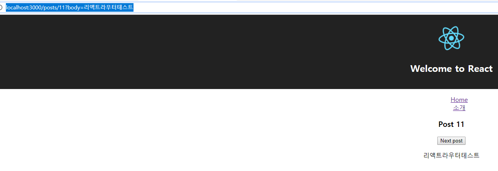

# React-Router


## React-Router란
특정 URL로 유저가 접근했을 때, URL을 해석하여 기존에 개발자가 선언한대로 요청한 URL에 알맞는 React Component를 렌더링해서 보여주는 역할
`Facebook 공식 라이브러리는 아니지만 React 관련 Router 라이브러리 중에서는 가장 많이 사용`


## React Router V4
- React Router의 최신버전
- React Router v3, 그 이하와는 API가 다름
- V3도 여전히 유지보수 진행중
- 대부분의 동작이 React Component로 이루어짐

### React Router 설치하기 전에..
`기존에 create-react-app이 설치되어있어야 한다.`
```
create-react-app . --scripts-version=react-scripts-ts
```

### lint 설정은 아래와 같이 하자.
[tslint.json]  
```
...
"rules": {
  "no-console": false,
  "member-access": [true, "no-public"],
  "jsx-no-lambda": false
}
```

### React Router 설치
```
// react는 navtive에서도 쓰이기 때문에 별도로 분리도어있어서 dom버전을 설치하여야 한다.
yarn add react-router-dom @types/react-router-dom
```

### React Router 사용
[App.tsx]  
```
import * as React from 'react';
import { BrowserRouter as Router, Route, } from 'react-router-dom';
import './App.css';

import logo from './logo.svg';

class App extends React.Component {
  render() {
    return (
      <Router>
        <div className="App">
          <header className="App-header">
            
            <h1 className="App-title">Welcome to React</h1>
          </header>
          <Route path="/" render={() => <h3>Home</h3>} />
          <Route path="/intro" render={() => <h3>소개</h3>} />
        </div>
      </Router>
    );
  }
}

export default App;
```

> 여기서 /intro로 접근했을 때 Home, 소개가 둘다 출력되는걸 확인할 수 있다. 왜냐하면 path에 맞는것은 전부다 render를 해준다. 즉, intro로 접근을 했지만 사실 /intro는 "/" root도 포함하는 개념이기 때문에 모두 출력해준다. 

`그러면 정확히 path="/"에 접근할때 정확히 해당 내용인 Home만 표시하게 하려면 exact설정을 true로 지정하자.`  
[App.tsx]  
```
...
<Route exact={true} path="/" render={() => <h3>Home</h3>} />
<Route path="/intro" render={() => <h3>소개</h3>} />
...
```
위와 같이 지정하면 아래 이미지처럼 /intro로 접근했을때는 "소개"만 /로 접근했을때는 Home만 출력되는걸 확인할 수 있다.  
  
  

Link 사용법  
[App.tsx]  
```
import * as React from 'react';
import { BrowserRouter as Router, Link, Route } from 'react-router-dom';
import './App.css';

import logo from './logo.svg';

class App extends React.Component {
  render() {
    return (
      <Router>
        <div className="App">
          <div className="App-header">
            
            <h1 className="App-title">Welcome to React</h1>
          </div>
          <nav>
            <ul>
              <li><Link to="/">Home</Link></li>
              <li><Link to="/intro">소개</Link></li>
            </ul>
          </nav>
          <Route exact={true} path="/" render={() => <h3>Home</h3>} />
          <Route path="/intro" render={() => <h3>소개</h3>} />
        </div>
      </Router>
    );
  }
}

export default App;
```
위와 같이 지정하고 페이지에서 해당 Link 태그의 내용을 클릭하면 페이지이동없이 rendering 되는것을 확인할 수 있다.
  
> Link는 실질적으론 a태그로 rendering이 된다.(개발자도구로 확인)


### BrowserRouter
- 다른 라우팅 컴포넌트(Route, Link)를 사용하기 위해서 기본적으로 감싸줘야 한다.
- 오직 하나의 자식만을 가질 수 있다.
- HashRouter는 Hash(#/)로 동작하는 Router

### Route
- path 속성으로 경로지정
- render, component(주로쓰임), children 속성으로 렌더링
- 실제 경로가 지정한 경로와 완벽히 매치되지 않더라도, 경로를 포함만 해도 렌더링(해결책: exact)
- 컴포넌트에 match, location, history라는 객체를 넘김

Route Component 사용법
아래 코드는 render말고 component를 사용하였을 때의 코드이다.  
[App.tsx]  
```
import * as React from 'react';
import { BrowserRouter as Router, Link, Route } from 'react-router-dom';
import './App.css';

import logo from './logo.svg';

// Component 추가
const Home = () => {
  return (
    <h3>Home</h3>
  );
}

class App extends React.Component {
  render() {
    return (
      <Router>
        <div className="App">
          <div className="App-header">
            
            <h1 className="App-title">Welcome to React</h1>
          </div>
          <nav>
            <ul>
              <li><Link to="/">Home</Link></li>
              <li><Link to="/intro">소개</Link></li>
            </ul>
          </nav>
          {/* rendr -> Component로 변경 */}
          <Route exact={true} path="/" component={Home} />
          <Route path="/intro" render={() => <h3>소개</h3>} />
        </div>
      </Router>
    );
  }
}

export default App;
```

### Link
- a태그로 렌더링되고 사용법도 비슷하나 실제 동작은 a태그와 다르게 페이지 전체를 리로드하지 않고 필요한 부분만 리로드함


## React-Router-Props
### 파라미터 넘기는 방법
[App.tsx]  
```
import * as React from 'react';
import { BrowserRouter as Router, Link, Route, RouteComponentProps } from 'react-router-dom';
import './App.css';

import logo from './logo.svg';

const Home = () => {
  return (
    <h3>Home</h3>
  );
}

// Component 추가
// RouteComponentProps 제너릭에 정의한게 실제로 페이지 url에서 우리가 정의한 paramter이다.
const Post = (props: RouteComponentProps<{ postId: string }>) => {
  return (
    <h3>Post {props.match.params.postId}</h3>
  );
}

class App extends React.Component {
  render() {
    return (
      <Router>
        <div className="App">
          <div className="App-header">
            
            <h1 className="App-title">Welcome to React</h1>
          </div>
          <nav>
            <ul>
              <li><Link to="/">Home</Link></li>
              <li><Link to="/intro">소개</Link></li>
            </ul>
          </nav>
          <Route exact={true} path="/" component={Home} />
          <Route path="/intro" render={() => <h3>소개</h3>} />
          {/* 파라미터를 선언한 내용 추가 */}
          <Route path="/posts/:postId" component={Post} />
        </div>
      </Router>
    );
  }
}

export default App;
```


### match
- Route 태그의 path에 정의한 것과 매치된정보를 담고 있다.  


### location
- 브라우저의 window.location 객체와 비슷
- URL을 다루기 쉽게 쪼개서 가지고 있음.(ex:/post/2?a=b&c=d#hash)

### history
- 브라우저의 window.history 객체와 비슷
- 주소를 임의로 변경하거나 되돌아갈 수 있다.
- 주소를 변경하더라도 SPA 동작방식에 맞게 페이지 일부만 리로드(=rendering)  


### 실습
[App.tsx]  
```
import * as React from 'react';
import { BrowserRouter as Router, Link, Route, RouteComponentProps } from 'react-router-dom';
import './App.css';

import logo from './logo.svg';

const Home = () => {
  return (
    <h3>Home</h3>
  );
};

const Post = (props: RouteComponentProps<{ postId: string }>) => {
  // 추가
  function goNextPost() {
    const nextPostId = Number(props.match.params.postId) + 1;
    props.history.push(`/posts/${nextPostId}`);
  }

  return (
    <div>
      <h3>Post {props.match.params.postId}</h3>
      {/* 버튼추가 */}
      <button onClick={goNextPost}>Next post</button>
      {/* URL Paramter Parsing */}
      <p>{new URLSearchParams(props.location.search).get('body')}</p>
    </div>
  );
};

class App extends React.Component {
  render() {
    return (
      <Router>
        <div className="App">
          <div className="App-header">
            
            <h1 className="App-title">Welcome to React</h1>
          </div>
          <nav>
            <ul>
              <li><Link to="/">Home</Link></li>
              <li><Link to="/intro">소개</Link></li>
            </ul>
          </nav>
          <Route exact={true} path="/" component={Home} />
          <Route path="/intro" render={() => <h3>소개</h3>} />
          <Route path="/posts/:postId" component={Post} />
        </div>
      </Router>
    );
  }
}

export default App;
```
이렇게 하면 페이지에서 Next Post버튼을 클릭하면 postId값이 계속 증가하는것을 확인할 수 있다.


## 라우팅 기능들

### 중첩 라우팅
PostList -> Post 로 중첩 라우팅이 되게 코드를 작성해보자.  
[App.tsx]  
```
import * as React from 'react';
import { BrowserRouter as Router, Link, Route, RouteComponentProps } from 'react-router-dom';
import './App.css';

import logo from './logo.svg';

const Home = () => {
  return (
    <h3>Home</h3>
  );
};

const Post = (props: RouteComponentProps<{ postId: string }>) => {
  function goNextPost() {
    const nextPostId = Number(props.match.params.postId) + 1;
    props.history.push(`/posts/${nextPostId}`);
  }

  return (
    <div>
      <h3>Post {props.match.params.postId}</h3>
      <button onClick={goNextPost}>Next post</button>
      <p>{new URLSearchParams(props.location.search).get('body')}</p>
    </div>
  );
};

// 추가
const PostList = (props: RouteComponentProps<{}>) => {
  return (
    <div>
      <Route exact={true} path={`${props.match.url}`} render={() => <h3>postList</h3>} />
      <Route path={`${props.match.url}/:postId`} component={Post} />
    </div>
  );
};

class App extends React.Component {
  render() {
    return (
      <Router>
        <div className="App">
          <div className="App-header">
            
            <h1 className="App-title">Welcome to React</h1>
          </div>
          <nav>
            <ul>
              <li><Link to="/">Home</Link></li>
              <li><Link to="/intro">소개</Link></li>
            </ul>
          </nav>
          <Route exact={true} path="/" component={Home} />
          <Route path="/intro" render={() => <h3>소개</h3>} />
          {/* 변경 */}
          <Route path="/posts" component={PostList} />
        </div>
      </Router>
    );
  }
}

export default App;
```

http://localhost:3000/posts 로 접속했을 때  


http://localhost:3000/posts/11?body=리액트라우터테스트 로 접속했을 때  


### Switch
```
<Route path={`${props.match.url}`} render={() => <h3>postList</h3>} />
<Route path={`${props.match.url}/:postId`} component={Post} />
```

만약 위의 코드처럼 exact=true가 없으면 http://localhost:3000/posts/11?body=리액트라우터테스트 로 접속했을 때 아래 이미지와 같이 postList도 함께 출력되는것을 볼 수 있다.  


이와 같이 의도하지 않는 컴포넌트가 렌더링되는 경우에 Switch로 감싸면된다.
```
<Switch>
  <Route path={`${props.match.url}`} render={() => <h3>postList</h3>} />
  <Route path={`${props.match.url}/:postId`} component={Post} />
</Switch>
```

Switch란?
- Route 태그를 감싸서 사용
- Javascript의 switch 문과 비슷
- Route 태그 중 매치되는 첫번째만 렌더
- Route 태그에 path를 지정하지 않은 경우, 매치되는 Route 태그의 컴포넌트가 없을 때 렌더
`따라서 순서에 유의하여야 한다.`  

[ 예제(404 페이지 생성) ]  
[App.tsx]  
```
import * as React from 'react';
// Switch 추가
import { BrowserRouter as Router, Link, Route, RouteComponentProps, Switch } from 'react-router-dom';
import './App.css';

import logo from './logo.svg';

const Home = () => {
  return (
    <h3>Home</h3>
  );
};

const Post = (props: RouteComponentProps<{ postId: string }>) => {
  function goNextPost() {
    const nextPostId = Number(props.match.params.postId) + 1;
    props.history.push(`/posts/${nextPostId}`);
  }

  return (
    <div>
      <h3>Post {props.match.params.postId}</h3>
      <button onClick={goNextPost}>Next post</button>
      <p>{new URLSearchParams(props.location.search).get('body')}</p>
    </div>
  );
};

const PostList = (props: RouteComponentProps<{}>) => {
  return (
    <div>
      <Route exact={true} path={`${props.match.url}`} render={() => <h3>postList</h3>} />
      <Route path={`${props.match.url}/:postId`} component={Post} />
    </div>
  );
};

// 추가
const NotFound = () => {
  return (
    <h3>Not Found!!</h3>
  );
};

class App extends React.Component {
  render() {
    return (
      <Router>
        <div className="App">
          <div className="App-header">
            
            <h1 className="App-title">Welcome to React</h1>
          </div>
          <nav>
            <ul>
              <li><Link to="/">Home</Link></li>
              <li><Link to="/intro">소개</Link></li>
            </ul>
          </nav>
          {/* Switch 태그로 감쌈 */}
          <Switch>
            <Route exact={true} path="/" component={Home} />
            <Route path="/intro" render={() => <h3>소개</h3>} />
            <Route path="/posts" component={PostList} />
            <Route component={NotFound} />
          </Switch>
        </div>
      </Router>
    );
  }
}

export default App;
```

http://localhost:3000/sadfasfsaas 와 같이 Route path가 정의되어있지 않는곳으로 접근하면 NotFound 컴포넌트가 렌더된다. (하기 이미지 참조)  


### Redirect
- Redirect를 하는 컴포넌트
- 마운트 되면 지정한 경로로 이동
- 기본적으로 replace 방식
- location 객체를 통해 리다이렉트 할 수 있다.  

[ 예제 Admin 페이지 ]  
[App.tsx]  
```
import * as React from 'react';
// Redirect 추가
import { BrowserRouter as Router, Link, Redirect, Route, RouteComponentProps, Switch } from 'react-router-dom';
import './App.css';

import logo from './logo.svg';

const Home = () => {
  return (
    <h3>Home</h3>
  );
};

const Post = (props: RouteComponentProps<{ postId: string }>) => {
  function goNextPost() {
    const nextPostId = Number(props.match.params.postId) + 1;
    props.history.push(`/posts/${nextPostId}`);
  }

  return (
    <div>
      <h3>Post {props.match.params.postId}</h3>
      <button onClick={goNextPost}>Next post</button>
      <p>{new URLSearchParams(props.location.search).get('body')}</p>
    </div>
  );
};

const PostList = (props: RouteComponentProps<{}>) => {
  return (
    <div>
      <Route exact={true} path={`${props.match.url}`} render={() => <h3>postList</h3>} />
      <Route path={`${props.match.url}/:postId`} component={Post} />
    </div>
  );
};

const NotFound = () => {
  return (
    <h3>Not Found!!</h3>
  );
};

// 추가
const Admin = () => {
  const isAdmin = false;
  return isAdmin
    ? <h3>Admin</h3>
    : <Redirect to="/" />
};

class App extends React.Component {
  render() {
    return (
      <Router>
        <div className="App">
          <div className="App-header">
            
            <h1 className="App-title">Welcome to React</h1>
          </div>
          <nav>
            <ul>
              <li><Link to="/">Home</Link></li>
              <li><Link to="/intro">소개</Link></li>
              <li><Link to="/admin">어드민</Link></li>
            </ul>
          </nav>
          <Switch>
            <Route exact={true} path="/" component={Home} />
            <Route path="/intro" render={() => <h3>소개</h3>} />
            <Route path="/posts" component={PostList} />
            {/* 추가 */}
            <Route path="/admin" component={Admin} />
            <Route component={NotFound} />
          </Switch>
        </div>
      </Router>
    );
  }
}

export default App;
```

위의 코드에서 Admin 컴포넌트의 코드만 참고하여 isAdmin의 boolean값이 바뀔때 마다 페이지가 어떻게 표시되는지 확인하자.
- isAdmin=true 일 때 http://localhost:3000/admin 접속했을 때  
  
- isAdmin=false 일 때 http://localhost:3000/admin 접속했을 때 http://localhost:3000 로 리다이렉트 되는걸 확인할 수 있다.  
  

### Old path
오래된 페이지들을 redirect하고 싶을 때 사용  
[App.tsx]
```
...
<Switch>
  <Route exact={true} path="/" component={Home} />
  <Route path="/intro" render={() => <h3>소개</h3>} />
  {/* from이 옛날주소 to는 신주소 (즉, about -> intro로 이전) */}
  <Redirect from="/about" to="/intro" />
  <Route path="/posts" component={PostList} />
  <Route path="/admin" component={Admin} />
  <Route component={NotFound} />
</Switch>
...
```
이제 http://localhost:3000/about 으로 접근하면 http://localhost:3000/intro로 리다이렉트 되는것을 볼 수 있다.

### NavLink
- 조금 특별한 Link 태그
- to에 지정한 path와 URL이 매칭되는 경우 특별한 스타일, 클래스를 적용할 수 있다.
`주로 네비게이션에 많이 쓰는 active 스타일을 적용하기 위한 컴포넌트이다.`
  
[App.tsx]
```
import * as React from 'react';
// NavLink 추가
import { BrowserRouter as Router, NavLink, Redirect, Route, RouteComponentProps, Switch } from 'react-router-dom';
import './App.css';

import logo from './logo.svg';

const Home = () => {
  return (
    <h3>Home</h3>
  );
};

const Post = (props: RouteComponentProps<{ postId: string }>) => {
  function goNextPost() {
    const nextPostId = Number(props.match.params.postId) + 1;
    props.history.push(`/posts/${nextPostId}`);
  }

  return (
    <div>
      <h3>Post {props.match.params.postId}</h3>
      <button onClick={goNextPost}>Next post</button>
      <p>{new URLSearchParams(props.location.search).get('body')}</p>
    </div>
  );
};

const PostList = (props: RouteComponentProps<{}>) => {
  return (
    <div>
      <Route exact={true} path={`${props.match.url}`} render={() => <h3>postList</h3>} />
      <Route path={`${props.match.url}/:postId`} component={Post} />
    </div>
  );
};

const NotFound = () => {
  return (
    <h3>Not Found!!</h3>
  );
};

// true로 수정
const Admin = () => {
  const isAdmin = true;
  return isAdmin
    ? <h3>Admin</h3>
    : <Redirect to="/" />
};

class App extends React.Component {
  render() {
    return (
      <Router>
        <div className="App">
          <div className="App-header">
            
            <h1 className="App-title">Welcome to React</h1>
          </div>
          <nav>
            <ul>
              {/* 링크를 NavLink로 변경 */}
              <li><NavLink exact={true} activeStyle={{ fontSize: 24 }} to="/">Home</NavLink></li>
              <li><NavLink activeStyle={{ fontSize: 24 }} to="/intro">소개</NavLink></li>
              <li><NavLink activeStyle={{ fontSize: 24 }} to="/admin">어드민</NavLink></li>
            </ul>
          </nav>
          <Switch>
            <Route exact={true} path="/" component={Home} />
            <Route path="/intro" render={() => <h3>소개</h3>} />
            {/* 추가 */}
            <Redirect from="/about" to="/intro" />
            <Route path="/posts" component={PostList} />
            <Route path="/admin" component={Admin} />
            <Route component={NotFound} />
          </Switch>
        </div>
      </Router>
    );
  }
}

export default App;
```

아래 이미지 처럼 NavLink를 클릭한것마다 폰트사이즈가 변경되는것을 확인할 수 있다.  


## 참조
https://www.inflearn.com/course/react-with-typescript#