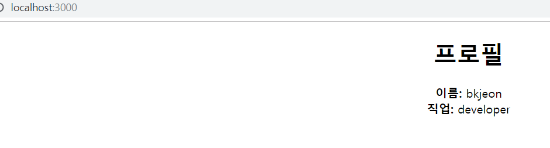
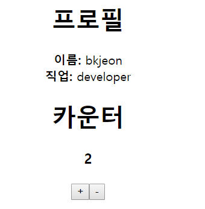
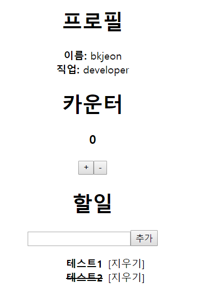

# Typescript with React + Redux


## 프로젝트 생성
먼저 타입스크립트 기반 프로젝트를 생성
```
create-react-app react-typescript-redux-example-1 --scripts-version=react-scripts-ts

// 실행방법
cd react-typescript-redux-example-1
yarn start
```

원활한 개발 환경을 위하여 tslint 설정값을 수정하자.  
[tslint.json]
```
{
  "extends": ["tslint:recommended", "tslint-react", "tslint-config-prettier"],
  "linterOptions": {
    "exclude": [
      "config/**/*.js",
      "node_modules/**/*.ts",
      "coverage/lcov-report/*.js"
    ]
  },
  "rules": {
    "no-console": false,
    "member-access": [true, "no-public"],
    "jsx-no-lambda": false,
    "no-empty-interface": false,
    "ordered-imports": [false],
    "object-literal-sort-keys": [false],
    "no-angle-bracket-type-assertion": false
  }
}
```


## 컴포넌트 작성
[src/components/Profile.tsx]
```
import * as React from 'react';

interface IProps {
  name: string;
  job: string;
}

class Profile extends React.Component<IProps> {
  render() {
    const { name, job } = this.props;
    return (
      <div>
        <h1>프로필</h1>
        <div>
          <b>이름: </b>
          {name}
        </div>
        <div>
          <b>직업: </b>
          {job}
        </div>
      </div>
    );
  }
}

export default Profile;
```

해당 컴포넌트를 App에서 렌더링하자.  
[src/App.tsx]
```
import * as React from 'react';
import './App.css';

import Profile from './components/Profile';

class App extends React.Component {
  render() {
    return (
      <div className="App">
        <Profile
          name="bkjeon"
          job="developer" 
        />
      </div>
    );
  }
}

export default App;
```

실행하여 페이지를 확인해보자.  
  

이제 해당 컴포넌트를 함수형 컴포넌트로 변경해보자.  
[src/components/Profile.tsx]
```
import * as React from 'react';

interface IProps {
  name: string;
  job: string;
}

const Profile: React.SFC<IProps> = ({name, job}) => (
    <div>
    <h1>프로필</h1>
    <div>
      <b>이름: </b>
      {name}
    </div>
    <div>
      <b>직업: </b>
      {job}
    </div>
  </div>
);

export default Profile;
```
위의 코드처럼 React.SFC 사용하지 않는다면 만약 컴포넌트에서 JSX가 아닌 문자열을 리턴하게되면 오류가 Profile이 아닌 App 에서 나타나게 되어 혼동을 초래할 수 있다.


## 카운터 컴포넌트 작성
React Component의 state도 사용하는 카운터 컴포넌트를 작성하자.  
[src/components/Counter.tsx]
```
import * as React from 'react';

interface IProps {

}

// State도 사용하므로 React.component<IProps, IState> 와 같이 추가하자.
interface IState {
  counter: number;
}

class Counter extends React.Component<IProps, IState> {
  state: IState = {
    counter: 0
  };

  onIncrement = (): void => {
    this.setState(
      ({ counter }) => ({ counter: counter + 1 })
    );
  }

  onDecrement = (): void => {
    this.setState(
      ({ counter }) => ({ counter: counter - 1 })
    );
  }

  render() {
    const { onIncrement, onDecrement } = this;
    return (
      <div>
        <h1>카운터</h1>
        <h3>{this.state.counter}</h3>
        <button onClick={onIncrement}>+</button>
        <button onClick={onDecrement}>-</button>
      </div>
    );
  }
}

export default Counter;
```

카운터 컴포넌트를 App에 렌더링하자.  
[src/App.tsx]
```
import * as React from 'react';
import './App.css';

import Counter from './components/Counter';
import Profile from './components/Profile';

class App extends React.Component {
  render() {
    return (
      <div className="App">
        <Profile
          name="bkjeon"
          job="developer" 
        />
        <Counter />
      </div>
    );
  }
}

export default App;
```

실행하여 카운트가 증가하는지 확인하자.  
  


## TO Do List 작성
할 일 목록 데이터를 관리할 수 있는 컴포넌트를 작성하자.  
    
[src/components/TodoItem.tsx]
```
import * as React from 'react';

interface IProps {
  text: string;
  done: boolean;
  onToggle(): void;
  onRemove(): void;
}

const TodoItem: React.SFC<IProps> = ({ text, done, onToggle, onRemove }) => (
  <li>
    <b 
      onClick={onToggle} 
      style={{
      textDecoration: done ? 'line-through' : 'none',
      }}
    >
      {text}
    </b>
    <span style={{marginLeft: '0.5rem'}} onClick={onRemove}>[지우기]</span>
  </li>
);

export default TodoItem;
```
  
[src/components/TodoList.tsx]  
컴포넌트에 만들게 되는 메소드의 파라미터에도 타입을 지정할 수 있다. (ex: ITodoItemData[]) 
```
import * as React from 'react';
import TodoItem from './TodoItem';

interface IProps {

}

interface ITodoItemData {
  id: number;
  text: string;
  done: boolean;
}

interface IState {
  todoItems: ITodoItemData[]; // TodoItemData 로 이뤄진 배열
  input: string;
}

class TodoList extends React.Component<IProps, IState> {

  id: number = 0;

  state: IState = {
    input: '',
    todoItems: [],
  };

  onToggle = (id: number): void => {
    const { todoItems } = this.state;
    const index = todoItems.findIndex(todo => todo.id === id); // id 로 인덱스 찾기
    const selectedItem = todoItems[index]; //  아이템 선택
    const nextItems = [ ...todoItems ]; // 배열 내용을 복사

    const nextItem = {
      ...selectedItem,
      done: !selectedItem.done,
    };

    nextItems[index] = nextItem; // 교체 처리

    this.setState({
      todoItems: nextItems
    });
  }

  onRemove = (id: number): void => {
    this.setState(
      ({ todoItems }) => ({
        todoItems: todoItems.filter(todo => todo.id !== id)
      })
    );
  }

  onChange = (e: React.FormEvent<HTMLInputElement>): void => {
    const { value } = e.currentTarget;
    this.setState({
      input: value
    });
  }

  onSubmit = (e: React.FormEvent<HTMLFormElement>): void => {
    e.preventDefault(); // 페이지 전환 막기
    // input 비우고, todoItems 추가
    this.setState(
      ({ todoItems, input }) => ({
        input: '',
        todoItems: todoItems.concat({
          done: false,
          id: this.id++,
          text: input
        })
      })
    );
  }

  render() {
    const { onSubmit, onChange, onToggle, onRemove } = this;
    const { input, todoItems } = this.state;

    const todoItemList = todoItems.map(
      todo => (
        <TodoItem
          key={todo.id}
          done={todo.done}
          onToggle={() => onToggle(todo.id)}
          onRemove={() => onRemove(todo.id)}
          text={todo.text}
        />
      )
    );

    return (
      <div>
        <h1>할일</h1>
        <form onSubmit={onSubmit}>
          <input onChange={onChange} value={input} />
          <button type="submit">추가</button>
        </form>
        <ul>
          {todoItemList}
        </ul>
      </div>
    );
  }
}

export default TodoList;
```
  
[src/App.tsx]  
```
import * as React from 'react';
import './App.css';

import Counter from './components/Counter';
import Profile from './components/Profile';
import TodoList from './components/TodoList';

class App extends React.Component {
  render() {
    return (
      <div className="App">
        <Profile
          name="bkjeon"
          job="developer" 
        />
        <Counter />
        <TodoList />
      </div>
    );
  }
}

export default App;
```

실행하면 아래와 같이 확인할 수 있다.  
  


## 참고
https://velopert.com/