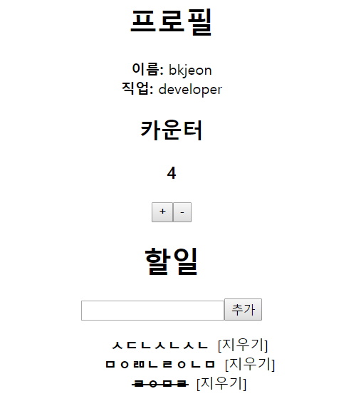

# Redux
리덕스는 상태관리 라이브러리이다. 리덕스는 우리가 만드는 컴포넌트들의 상태 관련 로직들을 다른 파일들로 분리시켜서 더욱 효율적으로 관리 할 수 있습니다. 또한, 컴포넌트끼리 상태를 공유하게 될 때 여러 컴포넌트를 거치지 않고도 손쉽게 상태 값을 전달 할 수 있다.

아래 그림을 참고하자. 왼쪽은 Redux를 적용하지 않은것이고, 오른쪽은 Redux를 사용한것이다.

  

`위의 이미지의 왼쪽 그림에서 만약 A에서 B로 데이터가 변경되거나 렌더를 다시해야 될 때 과정은 화살표 방향처럼 연결되어 있는 다른 컴포넌트들에게 상태가 전달된다. 이러한 나뭇가지식 관리를 하게 된다면 향 후 관리범위가 많아져서 골치아픈 상황이된다. 이러한 부분을 개선하고자 Redux를 사용하게 된 것이다.`

Redux는 Application Client쪽 state를 관리하기 위한 거대한 이벤트 루프이다.  
- 액션: 이벤트  
- 리듀서: 이벤트에 대한 반응

> 리액트(React) 상태(State) 생성자(Producer) 라는 뜻으로 해석해서 보면 쉽게 이해되고 외워진다. 실제로 리덕스(Redux)는 액션(Action)이 날라오면 리듀서(Reducer)가 스토어(Store)의 상태(State)르 변경시키는 방식으로 동작한다.  

만약 타입스크립트를 사용한다면 컨테이너 컴포넌트를 만들게 될 때, 그리고 리듀서를 작성하게 될 때, 단순히 타입 체킹 뿐만이 아니라 자동완성이 되므로 생산성이 매우 향상된다.


## Redux 패키지 설치
```
yarn add redux react-redux immutable redux-actions
yarn add --dev @types/redux @types/react-redux @types/immutable @types/redux-actions

// 설치 로그중에 immutable과 redux의 경우 이미 typescript지원이 내장되어있으니 설치가 필요없다고 표시되면 아래처럼 명령어를 실행한다.
yarn remove @types/immutable @types/redux
```


## 리덕스 모듈 작성
[react-typescript-redux-example-1](https://github.com/bkjeon1614/javascript-study/tree/master/reactjs/study/redux/react-typescript-redux-example-1)에서 만들었던 카운터 컴포넌트의 리덕스 모듈을 작성해보자.  


들어가기전에 Redux를 사용하는 어플리케이션을 구축하다 보면 기능별로 여러 개의 액션 타입과, 액션, 리듀서 한 세트를 만들어야 한다. 이들은 관습적으로 여러 개의 폴더로 나누어져서, 하나의 기능을 수정할 때는 이 기능과 관련된 여러 개의 파일을 수정해야 하는 일이 생긴다. 여기서 불편함을 느껴 나온 것이 Ducks 구조이다.

[Example]
```
// widgets.js

// Actions
const LOAD   = 'my-app/widgets/LOAD';
const CREATE = 'my-app/widgets/CREATE';
const UPDATE = 'my-app/widgets/UPDATE';
const REMOVE = 'my-app/widgets/REMOVE';

// Reducer
export default function reducer(state = {}, action = {}) {
  switch (action.type) {
    // do reducer stuff
    default: return state;
  }
}

// Action 생성자
export function loadWidgets() {
  return { type: LOAD };
}

export function createWidget(widget) {
  return { type: CREATE, widget };
}

export function updateWidget(widget) {
  return { type: UPDATE, widget };
}

export function removeWidget(widget) {
  return { type: REMOVE, widget };
}
```

Ducks 구조에는 몇 가지 규칙이 있다.
- 하나의 모듈은..
  - 항상 reducer()란 이름의 함수를 export default 해야한다.
  - 항상 모듈의 action 생성자들을 함수형태로 export 해야한다.
  - 항상 npm-module-or-app/reducer/ACTION_TYPE 형태의 action 타입을 가져야 한다.
  - 어쩌면 action 타입들을 UPPER_SNAKE_CASE로 export 할 수 있다.

> 리덕스 Ducks 구조는 액션 타입, 액션 생성 함수, 리듀서를 한 파일에 작성하는 것


## 카운터 컴포넌트의 Redux 모듈 작성
[src/store/modules/counter.ts]
```
import { createAction, handleActions } from 'redux-actions';

const DECREMENT = 'counter/DECREMENT';
const INCREMENT = 'counter/INCREMENT';

export const actionCreators = {
  decrement: createAction(DECREMENT),
  increment: createAction(INCREMENT),
};

export interface ICounterState {
  value: number;
}

const initialState: ICounterState = {
  value: 0
};

export default handleActions<ICounterState>(
  {
    [INCREMENT]: (state) => ({ value: state.value + 1 }),
    [DECREMENT]: (state) => ({ value: state.value - 1 }),
  }, 
  initialState
);
```
위의 코드는 컴포넌트가 아니므로 .tsx가 아닌 .ts확장자로 저장하자.


## 스토어 생성 및 적용
루트 리듀서를 생성하자.

> 루트 리듀서란 만약 계속하여 리듀서가 여러개 존재하게 된다. 여러개의 리듀서가 있으면 리덕스의 함수 combineReducers를 사용하여 하나의 리듀서로 합쳐줄 수 있다. 이것을 루트 리듀서라고 한다.

[src/store/modules/index.ts]
```
import { combineReducers } from 'redux';
import counter, { ICounterState } from './counter';

export default combineReducers({
  counter
});

// 스토어의 상태 타입 정의
export interface IStoreState {
  counter: ICounterState;
}
```

이제 스토어를 생성하는 함수를 만들자.
[src/store/configureStore.ts]
```
import modules from './modules';
import { createStore } from 'redux';

export default function configureStore() {
  const store = createStore(
    modules, /* preloadedState, */
    (window as any).__REDUX_DEVTOOLS_EXTENSION__ && (window as any).__REDUX_DEVTOOLS_EXTENSION__()
   );
  return store;
}
```

위 코드는 window 객체에 원래는 REDUX_DEVTOOLS_EXTENSION 이 없으므로 에러가 날 것이다. 따라서, 우리는 타입을 강제 캐스팅 (Type Assertion) 하자. any 를 사용하면, 문법 검사 시스템에서 사용하지 말라고 토를 달 것입니다.
any 를 자주 쓰는건 물론 좋지 않지만, 가끔씩은 이렇게 써야 하는 상황도 있습니다. 따라서, 문법 검사 설정을 변경하여 오류가 나타나지 않게 설정하자.
[tslint.json]
```
...
  "rules": {
    ...
    "no-any": false
  }
...
```

그 다음 index.tsx에서 Provider를 통해 리덕스 스토어를 적용하자.
[src/index.tsx]
```
import * as React from 'react';
import * as ReactDOM from 'react-dom';
import { Provider } from 'react-redux';
import App from './App';
import './index.css';
import registerServiceWorker from './registerServiceWorker';
import configureStore from './store/configureStore';

const store = configureStore();

ReactDOM.render(
  <Provider store={store}>
    <App />
  </Provider>,
  document.getElementById('root') as HTMLElement
);
registerServiceWorker();
```


## 카운터 컨테이너 컴포넌트 생성
만들기전에 디렉토리를 편하게 불러올 수 있게 NODE_PATH와 baseUrl 값을 설정하자.

[/.env]
NODE_PATH는 최상단 디렉토리에 .env파일을 생성하여 코드를 작성
```
NODE_PATH=src
```

그 다음 타입스크립트 도구가 제대로 인식할 수 있도록 baseUrl을 설정
[/tsconfig.json]
```
{
  "compilerOptions": {
    "baseUrl": "./src",
    "outDir": "build/dist",
    ...
  },
  "exclude": [
    "node_modules",
    ...
  ]
}
```
위의 내용이 다 완료되면 IDE와 개발 서버를 재 시작 한다.  

그 다음 기존의 Counter 컴포넌트를 프리젠테이셔널 컴포넌트로서 사용하기 위해 들고있던 state와 method들을 제거하고 아래 코드로 변경하자.
[src/components/Counter.tsx]
```
import * as React from 'react';

interface IProps {
  value: number;
  onIncrement(): void;
  onDecrement(): void;
}

const Counter: React.SFC<IProps> = ({ value, onIncrement, onDecrement }) => (
  <div>
    <h2>카운터</h2>
    <h3>{value}</h3>
    <button onClick={onIncrement}>+</button>
    <button onClick={onDecrement}>-</button>
  </div>
);

export default Counter;
```

컨테이너 컴포넌트를 작성하자.
[src/containers/CounterContainer.tsx]
```
import * as React from 'react';
import Counter from 'components/Counter';
import { actionCreators as counterActions } from 'store/modules/counter';
import { connect } from 'react-redux';
import { bindActionCreators } from 'redux';
import { IStoreState } from 'store/modules';

export interface IProps {
  value: number;
  CounterActions: typeof counterActions;
};

class CounterContainer extends React.Component<IProps> {
  onIncrement = () => {
    const { CounterActions } = this.props;
    CounterActions.increment();
  }
  onDecrement = () => {
    const { CounterActions } = this.props;
    CounterActions.decrement();
  }
  render() {
    const { onIncrement, onDecrement } = this;
    const { value } = this.props;
    return (
      <Counter
        onIncrement={onIncrement}
        onDecrement={onDecrement}
        value={value}
      />
    );
  }
}

export default connect(
  ({ counter }: IStoreState) => ({
    value: counter.value
  }),
  (dispatch) => ({
    CounterActions: bindActionCreators(counterActions, dispatch)
  })
)(CounterContainer);
```

App에서 기존 Counter을 CounterContainer로 변경하자.
[src/App.tsx]
```
import * as React from 'react';
import './App.css';

import CounterContainer from 'containers/CounterContainer';
import Profile from './components/Profile';
import TodoList from './components/TodoList';

class App extends React.Component {
  render() {
    return (
      <div className="App">
        <Profile
          name="bkjeon"
          job="developer" 
        />
        <CounterContainer />
        <TodoList />
      </div>
    );
  }
}

export default App;
```


## TodoList 리덕스 모듈 생성
[src/store/modules/todos.ts]
```
import { Record, List } from 'immutable';
import { createAction, handleActions, Action } from 'redux-actions';

const CREATE = 'todos/CREATE';
const REMOVE = 'todos/REMOVE';
const TOGGLE = 'todos/TOGGLE';
const CHANGE_INPUT = 'todos/CHANGE_INPUT';

type CreatePayload = string;
type RemovePayload = number;
type TogglePayload = number;
type ChangeInputPayload = string;

/* type AnotherPayload = {
  something: string;
  like: number;
  this: boolean
}; */

export const actionCreators = {
  create: createAction<CreatePayload>(CREATE),
  remove: createAction<RemovePayload>(REMOVE),
  toggle:  createAction<TogglePayload>(TOGGLE),
  changeInput: createAction<ChangeInputPayload>(CHANGE_INPUT)
};

const TodoItemRecord = Record({
  id: 0,
  text: '',
  done: false
});

interface ITodoItemDataParams {
  id?: number;
  text?: string;
  done?: boolean;
}

export class TodoItemData extends TodoItemRecord {
  static autoId = 0;
  id: number;
  text: string;
  done: boolean;
  constructor(params?: ITodoItemDataParams) {
    const id = TodoItemData.autoId;
    if (params) {
      super({
        ...params,
        id,
      });
    } else {
      super({ id });
    }
    TodoItemData.autoId = id + 1;
  }
}

const TodosStateRecord = Record({
  todoItems: List(),
  input: ''
});

export class TodosState extends TodosStateRecord {
  todoItems: List<TodoItemData>;
  input: string;
}

const initialState = new TodosState();

export default handleActions<TodosState, any>(
  {
    [CREATE]: (state, action: Action<CreatePayload>): TodosState => {
      return <TodosState> state.withMutations(
        s => {
          s.set('input', '')
          .update('todoItems', (todoItems: List<TodoItemData>) => todoItems.push(
            new TodoItemData({ text: action.payload })
          ));
        }
      );
    },
    [REMOVE]: (state, action: Action<RemovePayload>): TodosState => {
      return <TodosState> state.update(
        'todoItems',
        (todoItems: List<TodoItemData>) => todoItems.filter(
          t => t ? t.id !== action.payload : false
        )
      );
    },
    [TOGGLE]: (state, action: Action<TogglePayload>): TodosState => {
      const index = state.todoItems.findIndex(t => t ? t.id === action.payload : false);
      return <TodosState> state.updateIn(['todoItems', index, 'done'], done => !done);
    },
    [CHANGE_INPUT]: (state, action: Action<ChangeInputPayload>): TodosState => {
      return <TodosState> state.set('input', action.payload);
    },
  },
  initialState
);
```
> 여기에선 Immutable, createAction, handleActions 를 사용했다. Immutable 을 사용하게 될 때에는, Map 대신에 Record 를 사용하면 타입스크립트의 이점을 제대로 누릴 수 있다. 추가적으로, 각 액션의 Payload 또한 타입을 지정해두면, 각 액션 생성함수를 호출하거나, 혹은 리듀서에서 액션을 처리하게 될 때 큰 노력 없이도 바로 어떠한 종류의 payload 를 가진 액션인지 파악 가능합니다.

`payload: 페이로드는 사용에 있어서 전송되는 데이터를 뜻한다. (헤더와 메타데이터는 제외)`

리듀서의 각 함수를 보면 
```
return <TodosState> state...
```
이런식으로 되어있는데 이 부분은 기본적으로 state.update, state.set 등의 함수의 결과물 타입이 Map 이기 때문에 이를 다시 타입 캐스팅 해주는 것이다. (ex: window as any..) 따라서, return state…. as TodosState 와 같은 형식으로 하셔도 무방하다.  

이제 만든 모듈을 combineReducers 쪽과 StoreState 에 추가하자.
[src/store/modules/index.ts]
```
import counter, { ICounterState } from './counter';
import { combineReducers } from 'redux';
import todos, { TodosState } from './todos';

export default combineReducers({
  counter,
  todos
});

// 스토어의 상태 타입 정의
export interface IStoreState {
  counter: ICounterState;
  todos: TodosState;
}
```


## TodoList 컴포넌트 프리젠테이셔널 컴포넌트로 전환
TodoList의 state를 없애고 함수형 컴포넌트로 전환하자.
[src/components/TodoList.tsx]
```
import * as React from 'react';
import TodoItem from './TodoItem';
import { TodoItemData } from 'store/modules/todos';
import { List } from 'immutable';

interface IProps {
  input: string;
  todoItems: List<TodoItemData>;
  onCreate(): void;
  onRemove(id: number): void;
  onToggle(id: number): void;
  onChange(e: any): void;
}

const TodoList: React.SFC<IProps> = ({
  input, todoItems, onCreate, onRemove, onToggle, onChange
}) => {
  const todoItemList = todoItems.map(
    todo => todo ? (
      <TodoItem
        key={todo.id}
        done={todo.done}
        onToggle={() => onToggle(todo.id)}
        onRemove={() => onRemove(todo.id)}
        text={todo.text}
      />
    ) : null
  );

  return (
    <div>
      <h1>할일</h1>
      <form 
        onSubmit={
          (e: React.FormEvent<HTMLFormElement>) => {
            e.preventDefault();
            onCreate();
          }
        }
      >
        <input onChange={onChange} value={input} />
        <button type="submit">추가</button>
      </form>
      <ul>
        {todoItemList}
      </ul>
    </div>
  );
};

export default TodoList;
```

TodoListContainer 생성
[src/containers/TodoListContainer.tsx]
```
import * as React from 'react';
import TodoList from 'components/TodoList';
import { connect } from 'react-redux';
import { IStoreState } from 'store/modules';
import { 
  TodoItemData,
  actionCreators as todosActions
} from 'store/modules/todos';
import { bindActionCreators } from 'redux';
import { List } from 'immutable';

interface IProps {
  todoItems: List<TodoItemData>;
  input: string;
  TodosActions: typeof todosActions;
}

class TodoListContainer extends React.Component<IProps> {
  onCreate = () => {
    const { TodosActions, input } = this.props;
    TodosActions.create(input);
  }
  onRemove = (id: number) => {
    const { TodosActions } = this.props;
    TodosActions.remove(id);
  }
  onToggle = (id: number) => {
    const { TodosActions } = this.props;
    TodosActions.toggle(id);
  }
  onChange = (e: React.FormEvent<HTMLInputElement>) => {
    const { value } = e.currentTarget;
    const { TodosActions } = this.props;
    TodosActions.changeInput(value);
  }
  render() {
    const { input, todoItems } = this.props;
    const { onCreate, onRemove, onToggle, onChange } = this;

    return (
      <TodoList
        input={input}
        todoItems={todoItems}
        onCreate={onCreate}
        onRemove={onRemove}
        onToggle={onToggle}
        onChange={onChange}
      />
    );
  }
}

export default connect(
  ({ todos }: IStoreState) => ({
    input: todos.input,
    todoItems: todos.todoItems,
  }),
  (dispatch) => ({
    TodosActions: bindActionCreators(todosActions, dispatch),
  })
)(TodoListContainer);
```

App에서 TodoList를 TodoListContainer 로 교체
[src/App.tsx]
```
import * as React from 'react';
import './App.css';

import CounterContainer from 'containers/CounterContainer';
import Profile from './components/Profile';
import TodoListContainer from 'containers/TodoListContainer';

class App extends React.Component {
  render() {
    return (
      <div className="App">
        <Profile
          name="bkjeon"
          job="developer" 
        />
        <CounterContainer />
        <TodoListContainer />
      </div>
    );
  }
}

export default App;
```

앱을 실행하면 아래와 같이 적용된 내용을 확인할 수 있다.
  


## 참고
https://blog.codecentric.de  
https://velopert.com/  
https://devlog.jwgo.kr/